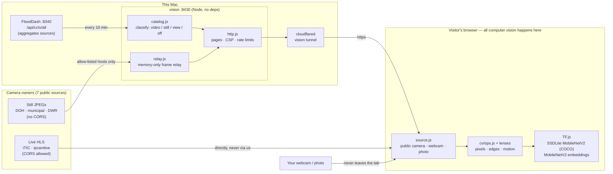
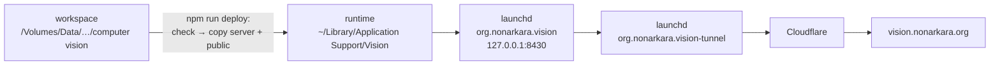

# VISION — how a computer sees · คอมพิวเตอร์มองเห็นอย่างไร

**Live: [vision.nonarkara.org](https://vision.nonarkara.org)**

A public, bilingual (ไทย / English) classroom for computer vision. Visitors point the machine at Thailand's open road cameras — or at **their own camera or photos** — and watch it go from pixels → numbers → edges → motion → "car 68%".

Every model runs in the visitor's browser (TensorFlow.js, self-hosted weights). The server never looks at a picture: it serves the site, publishes the camera catalogue, and relays still frames from allow-listed hosts **in memory only**.

---

## The story

Smart-city work took **Dr Non Arkaraprasertkul** through city operations centres (IOCs) in Thailand and abroad — Nakhon Si Thammarat, Patong, Rawai, New Taipei, Shenzhen, Los Angeles. They looked alike: a wall of screens, hundreds of camera feeds, a handful of operators. And people being people, someone was dozing, someone was texting, someone was on a long break.

Which raised the question: **how do we know the humans didn't miss anything?**

That was his first understanding of what computer vision should be — not a machine that replaces the operator or knows who anyone is, but an eye that doesn't blink, watching every screen and tapping a human on the shoulder: *this one, now* — always with a confidence number, because machines miss things too.

Knowledge came from **Dr Supakorn Siddhichai** — PhD in computer vision, Imperial College London; now acting CEO of depa, where Dr Non works. Dr Non learned computer vision from him, and together they built this system. The full story, with the photos from those control rooms, is at [/story](https://vision.nonarkara.org/story).

### Makers

| | |
|---|---|
| **Dr Non Arkaraprasertkul** · creator | Senior Expert, Smart City Promotion Department, Digital Economy Promotion Agency (depa). Initiator and steward of [FloodDash](https://flood.nonarkara.org) — the camera wall this classroom runs on. |
| **Dr Supakorn Siddhichai** · co-creator, computer vision | PhD in computer vision, Imperial College London. Acting CEO, depa. |

---

## Rooms

| URL | Room | What you can do |
|---|---|---|
| `/` | Home | One live camera, five lenses: picture · numbers · edges · motion · objects. "Try it on your own camera." |
| `/learn` | 01 Learn | Eight chapters, each with a live instrument: pixels, colour channels, thresholds/Otsu, 3×3 convolution, Sobel edges, frame differencing, a detector with a confidence slider, and what it cannot do. |
| `/cameras` | 02 Cameras | Tile-free dot map of ~3,500 cameras from 7 sources; filter, study any readable camera, run a polite census. |
| `/train` | 03 Train | Teachable-machine: examples from your webcam/camera/photo → MobileNetV2 embeddings → k-NN and a trained softmax layer, loss curve, PCA map; then judge cameras nationwide. |
| `/games` | 04 Games | Count race vs the detector, fewest-pixels guessing, and "fool the machine" on your own webcam. |
| `/everyday` | 05 Everyday | Face unlock, QR, OCR, X-rays, lane keeping, self-checkout, crop apps, traffic cameras — how each works and fails. |
| `/research` | 06 Research | Sixty years of papers, the ones this site runs on, open questions. |
| `/system` | 07 System | Diagrams, relay rules, CSP, models, live health, credits. |
| `/legal` | 08 Fine print | PDPA (B.E. 2562), ownership, what not to do, takedowns. |
| `/story` | The story | The IOC photos (with the detector counting screens vs people), a live six-camera wall the machine watches, the makers. |

---

## Architecture



### How one still frame travels

```mermaid
sequenceDiagram
  participant B as Browser
  participant V as vision server
  participant C as Camera owner
  B->>V: GET /api/frame?id=maholan:123
  Note over V: id must be in the catalogue<br/>URL comes from a server-side map,<br/>never from the request
  alt cached < 30 s
    V-->>B: frame from memory
  else
    V->>C: fetch (https, no redirects, 9 s timeout,<br/>≤4 in flight, ≤2 per host)
    C-->>V: image/jpeg ≤ 4 MB
    V-->>B: frame (kept in RAM 30 s, never on disk)
  end
  Note over B: lenses + models run here;<br/>nothing is sent back
```

### Rules the code enforces

- **Privacy:** webcam and photos never leave the tab; no uploads, no accounts, no analytics, no cookies (localStorage holds only the language choice and game best scores). No face recognition, no plate reading, no stored imagery.
- **Not an open proxy:** relay serves only catalogue ids on allow-listed https hosts, rejects redirects, non-images, tiny or > 4 MB bodies; per-host circuit breaker.
- **Strict CSP:** `script-src 'self'`, no inline script/style, no eval (TF.js's regenerator fallback is pre-empted in `ml/tf.js`), media only from the two CORS video hosts.
- **Honesty in the UI:** every machine answer carries its confidence; "not detected ≠ not there".

---

## Run

```bash
npm run dev        # http://localhost:8431 (reads cameras from FloodDash on :8340)
npm test           # unit tests: catalogue, relay, http, CV ops, learner
npm run check      # tests + scripts/check-site.mjs (pages, links, imports, CSP hazards, model shards)
npm run deploy     # checks, stages the release, restarts the production app
```

No dependencies. Node ≥ 22. Webcam access needs a secure context: `localhost` or https.

## Layout

| Path | What |
|---|---|
| `server/` | `index.js` routes · `catalog.js` FloodDash → camera kinds · `relay.js` memory-only still relay · `http.js` static, CSP, limits |
| `public/*.html` | one file per room; partials in `public/partials/` are stitched in per request |
| `public/js/core/` | i18n, catalogue, frame sources (public camera · webcam · photo), the shared specimen bar |
| `public/js/cv/` | classical CV (pure functions, tested in Node), lenses, drawing |
| `public/js/ml/` | TF.js loader, SSDLite detector (COCO), MobileNetV2 embedder, kNN / softmax learner |
| `public/js/<room>/` | each room's instruments |
| `public/models/` | weights, cached immutable for a year — a new model gets a new folder |
| `public/CCTV photos/` | original IOC photographs (with EXIF); web copies live in `public/img/ioc/` |
| `ops/` | launchd services and tunnel routing template |

## Your own camera

Any instrument with a specimen bar has **My camera**, **Switch camera** (front/back on phones) and **My photo**. Front cameras are mirrored at the source, so every lens and model sees what the person sees. Append `?source=mine` to any room's URL to start on the webcam. Frames never leave the tab.

## Ship



Production runs as `org.nonarkara.vision` on `127.0.0.1:8430`, behind the dedicated `vision` Cloudflare tunnel (`org.nonarkara.vision-tunnel`). The runtime is `~/Library/Application Support/Vision`: launchd cannot reliably start the app from the external project volume. Service definitions and the tunnel routing template live in `ops/`; credentials remain in `~/.cloudflared`.

Bump `version` in `package.json` on every release (it stamps asset URLs and ETags), then run `npm run deploy`. It checks the site, copies code and public assets without original CCTV photos, preserves the production catalogue, and restarts only the app. Verify the public `/api/health` afterwards.

## Screens

Every canvas instrument offers **Full screen**. Desktop browsers use native fullscreen; narrow screens use a viewport mode with an explicit exit and isolated background controls. Training keeps the camera and example controls together. Camera credits remain visible. Escape restores the previous view; live canvases redraw at their new size. The interface is checked in Thai and English from 360px phones to 1920px displays, including landscape.

## Takedowns & contact

Camera owners: open an issue at [github.com/Nonarkara/vision/issues](https://github.com/Nonarkara/vision/issues) with the camera's name or id and what you'd like (remove, or stop relaying frames). See [/legal#takedown](https://vision.nonarkara.org/legal#takedown).

## Credits

Cameras belong to the agencies that run them (GISTDA / BMA / DOH / iTIC, Nakhon Si Thammarat, Pak Kret, Rangsit, DWR, cctv.maholan.net), aggregated by FloodDash. TensorFlow.js and model weights (Apache-2.0), hls.js (Apache-2.0), IBM Plex, Archivo Narrow, JetBrains Mono (OFL). Colour: Sanzo Wada, Plate 303, via [Palette](https://colors.nonarkara.org). Datasets: COCO (Lin et al., 2014), ImageNet (Deng et al., 2009).

© 2026 Dr Non Arkaraprasertkul. All rights reserved.
