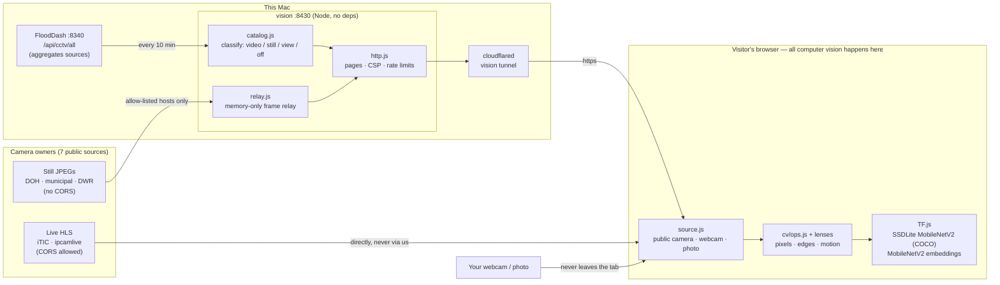
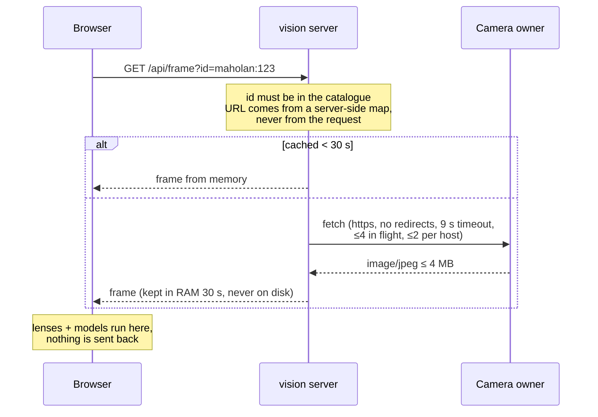
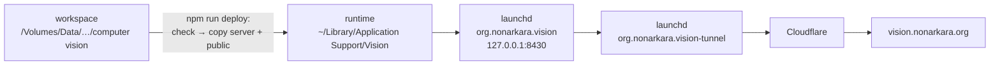

# VISION — how a computer sees · คอมพิวเตอร์มองเห็นอย่างไร

**Live: [vision.nonarkara.org](https://vision.nonarkara.org)**

A public, bilingual (ไทย / English) classroom for computer vision. Visitors point the machine at Thailand's open road cameras — or at **their own camera or photos** — and watch it go from pixels → numbers → edges → motion → "car 68%".

Every model runs in the visitor's browser (TensorFlow.js and MediaPipe, self-hosted weights). The server never looks at a picture: it serves the site, publishes the camera catalogue, and relays still frames from allow-listed hosts **in memory only**.

---

## Learn computer vision from this repository · เรียนจากที่เก็บโค้ดนี้


This repository is also a textbook. **[The Vision handbook](docs/README.md)** explains computer vision from pixels to trained models, chapter by chapter, using the exact code that runs the site — with worked numbers, diagrams, a Thai summary and a self-serve exercise in every chapter, and **eight runnable lessons** that need nothing but Node 22. The site publishes the same chapters as a browsable library at **[/handbook](https://vision.nonarkara.org/handbook)**:

```bash
node examples/01-pixels.mjs              # a picture is a grid of numbers
node examples/03-convolution.mjs         # one 3×3 step, worked by hand
node examples/07-transfer-learning.mjs   # teach a model — and watch it learn the wrong lesson
```

| | Chapter | Run |
|---|---|---|
| 01 | [Pictures are numbers](docs/01-pictures-are-numbers.md) | `examples/01-pixels.mjs` |
| 02 | [Light, colour and thresholds](docs/02-colour-and-thresholds.md) | `examples/02-threshold.mjs` |
| 03 | [Convolution and edges](docs/03-convolution-and-edges.md) | `examples/03-convolution.mjs` |
| 04 | [Motion](docs/04-motion.md) | `examples/04-motion.mjs` |
| 05 | [Neural networks](docs/05-neural-networks.md) | — |
| 06 | [Object detection](docs/06-object-detection.md) | `examples/05-detection-nms.mjs` · `examples/06-precision-recall.mjs` |
| 07 | [Teaching a machine](docs/07-transfer-learning.md) | `examples/07-transfer-learning.mjs` |
| 08 | [Limits and ethics](docs/08-limits-and-ethics.md) | `examples/08-catalogue.mjs` |

System design: [architecture](docs/system/architecture.md) · [the frame relay](docs/system/relay.md) · [browser runtime](docs/system/browser-runtime.md) · [operations](docs/system/operations.md) · [CV-as-a-service blueprint](docs/system/cvaas-blueprint.md) (proposed). Reference: [models](docs/reference/models.md) · [API](docs/reference/api.md) · [glossary ไทย/English](docs/reference/glossary.md) · [reading list](docs/reference/reading-list.md) · [browser actions](docs/reference/browser-actions.md).

Every PNG in the handbook is generated by the examples (`npm run figures`) from synthetic scenes — no real camera frames, so no real people; the six diagrams in `docs/img/*.svg` are drawn by hand. `tests/examples.test.js` fails if the code ever stops printing a number the handbook quotes.

---

## The story

Smart-city work took **Dr Non Arkaraprasertkul** through city operations centres (IOCs) in Thailand and abroad — Nakhon Si Thammarat, Patong, Rawai, New Taipei, Shenzhen, Los Angeles. They looked alike: a wall of screens, hundreds of camera feeds, a handful of operators. And people being people, someone was dozing, someone was texting, someone was on a long break.

Which raised the question: **how do we know the humans didn't miss anything?**

That was his first understanding of what computer vision should be — not a machine that replaces the operator or knows who anyone is, but an eye that doesn't blink, watching every screen and tapping a human on the shoulder: *this one, now* — always with a confidence number, because machines miss things too.

An early spark came from conversations with **Dr Supakorn Siddhichai**, who trained in computer vision at Imperial College London decades ago and is now acting CEO of depa, where Dr Non works. The curiosity was his to light; the learning, the design and every line of this system are Dr Non's. The full story, with the photos from those control rooms, is at [/story](https://vision.nonarkara.org/story).

### Maker

| | |
|---|---|
| **Dr Non Arkaraprasertkul** · creator and builder | Senior Expert, Smart City Promotion Department, Digital Economy Promotion Agency (depa). Initiator and steward of [FloodDash](https://flood.nonarkara.org) — the camera wall this classroom runs on. |

---

## The design system

One page owns it: [`public/css/vision.css`](public/css/vision.css). Colour is Sanzo Wada's Plate 303 in four hues, and **no fifth hue is admitted**. Each hue also carries a `deep` and a `pale` step built on one shared ladder — 76% hue + 24% black, 78% hue + 22% white — so a pale Olive and a pale Naples Yellow are visibly the same move rather than two accidental colours.

Every pairing the CSS is allowed to set is measured, and every forbidden pairing is proved illegible rather than assumed:

```bash
npm run palette      # print the ladder and 21 measured contrast ratios
```

The ladder buys one real freedom: base Peach Red on Naples is 2.7:1 and was always banned as text on paper, while `signal-deep` clears 13.0:1 — so emphasis set in signal on the paper ground is legal now, same hue, same job, one step down. `npm run check` fails if that ever stops being true.

Type is eight steps rather than three, and the playfulness comes from mixing the three families — Archivo Narrow for display Latin, IBM Plex Sans/Thai for reading, JetBrains Mono for every number — in named pairings (`.stem`, `.measure`, `.mix`) rather than from arbitrary sizes.

## The Drive room's street

`public/js/drive/street.js` builds everything beside the road from the track's own centreline, in real metres: kerbs at 3.2 m, footways 2.6 m deep with a 15 cm upstand, shophouses 1.2 m behind them, lamps every 30 m at 8.5 m, utility poles every 45 m at 9 m, bicycles and motorbikes at the kerb.

The rule the room is built on: **the simulated camera may only name things the site's real detector can name.** Every detectable item carries a real COCO id and the same Thai name the model prints in `ml/labels.js`, and `tests/street.test.js` checks that against the real table. A lamp post is 8.5 m tall, three metres from the car, and COCO has no category for it — so it is drawn and never given a box. That gap is the lesson, not a defect.

---

## Rooms

| URL | Room | What you can do |
|---|---|---|
| `/` | Home | One live camera, five lenses: picture · numbers · edges · motion · objects. "Try it on your own camera." |
| `/learn` | 01 Learn | Eight chapters, each with a live instrument: pixels, colour channels, thresholds/Otsu, 3×3 convolution, Sobel edges, frame differencing, a detector with a confidence slider, and what it cannot do. |
| `/cameras` | 02 Cameras | Tile-free dot map of ~4,000 cameras from 7 sources; filter, study any readable camera, run a polite census. |
| `/train` | 03 Train | Guided lessons on one video: label frames (supervised nearest neighbours), group unnamed frames (two-cluster k-means), reward alert actions (one-step contextual bandit). Drawn practice clip, public-camera switching and local video files; optional object teaching, trained layer and diagnostic tools. |
| `/gesture` | 04 Gestures | Teach 2–4 gestures (one finger, palm, …), bind each to a small in-browser action (beep, buzz, flash, lamps, tone, link); honest limits of what a page may do. |
| `/drive` | 05 Drive | A real street, not a bare track: kerbs, footways, buildings behind them, street lamps, utility poles, parked bicycles and motorbikes, hydrants, benches, planters, people and dogs. Two/four lanes, roundabout or Bangkok-inspired city; 6–24 cars. Click any car for its moving driver's view, with detection boxes and computed acceleration. Day, rain, night, sun glare. Written rules and simulated detections, not a trained driving system. Behind a CAPTCHA that explains where the training data came from. |
| `/games` | 06 Games | Count race vs the detector, fewest-pixels guessing, and "fool the machine" on your own webcam. |
| `/everyday` | 07 Everyday | Face unlock, QR, OCR, X-rays, lane keeping, self-checkout, crop apps, traffic cameras — how each works and fails. |
| `/research` | 08 Research | Sixty years of papers, the ones this site runs on, open questions. |
| `/system` | 09 System | Diagrams, relay rules, CSP, models, live health, credits. |
| `/legal` | 10 Fine print | PDPA (B.E. 2562), ownership, what not to do, takedowns. |
| `/story` | The story | The IOC photos (with the detector counting screens vs people), a live six-camera wall the machine watches, the maker. |

---

## Architecture



### How one still frame travels



### Rules the code enforces

- **Privacy:** webcam and photos never leave the tab; no uploads, no accounts, no analytics, no cookies (localStorage holds only the language choice and game best scores). No face recognition, no plate reading, no stored imagery.
- **Not an open proxy:** relay serves only catalogue ids on allow-listed https hosts, rejects redirects, non-images, tiny or > 4 MB bodies; per-host circuit breaker.
- **Strict CSP:** `script-src 'self'`, no inline script/style, no eval (TF.js's regenerator fallback is pre-empted in `ml/tf.js`), media only from the two CORS video hosts.
- **Honesty in the UI:** every machine answer carries its confidence; "not detected ≠ not there".

---

## Run

```bash
npm run dev        # http://localhost:8431 (reads cameras from FloodDash on :8340)
npm test           # unit tests: catalogue + store, relay, http, routes,
                   # sources, layer races, fullscreen, and the handbook's numbers
npm run check          # build-handbook --check + tests + scripts/check-site.mjs (pages, links, reachability, imports, CSP hazards, language parity, robots and sitemap, model shards) + scripts/check-docs.mjs (handbook links and anchors)
npm run build:handbook # re-render docs/*.md as the site's /handbook section
npm run figures    # regenerate the handbook's figures from examples/
npm run deploy     # checks, stages the release, restarts the production app
```

No dependencies. Node ≥ 22. Webcam access needs a secure context: `localhost` or https.

## Layout

| Path | What |
|---|---|
| `server/` | `index.js` routes · `catalog.js` FloodDash → camera kinds · `relay.js` memory-only still relay · `http.js` static, CSP, limits |
| `public/*.html` | one file per room; partials in `public/partials/` are stitched in per request |
| `public/js/core/` | i18n, catalogue, frame sources (public camera · webcam · photo), the shared specimen bar |
| `public/js/cv/` | classical CV (pure functions, tested in Node), lenses, drawing |
| `public/js/ml/` | TF.js loader, SSDLite detector (COCO), MobileNetV2 embedder, kNN / softmax learner |
| `public/js/<room>/` | each room's instruments; `drive/street.js` builds the street around the road and `drive/captcha.js` the challenge in front of it |
| `public/models/` | weights, cached immutable for a year — a new model gets a new folder |
| `public/CCTV photos/` | original IOC photographs (with EXIF); web copies live in `public/img/ioc/` |
| `ops/` | launchd services and tunnel routing template |
| `tests/` | eleven `node --test` files: server, relay, CV ops, learner, sources, layer races, the street and its COCO classes, and the handbook's quoted numbers |
| `scripts/` | `build-handbook.mjs` (renders `docs/*.md` to the site's `/handbook` section; `--check` fails when stale) · `slug.mjs` (shared heading slugs) · `check-site.mjs` (pages, links, reachability, imports, CSP, parity, robots/sitemap, model shards) · `check-docs.mjs` (handbook links and anchors) · `palette-measure.mjs` (prints the tone ladder and proves every colour pairing) · `deploy-local.mjs` |
| `data/` | `cameras.json` — the last catalogue FloodDash handed us; gitignored, recreated on first run |
| `docs/` | the handbook: eight chapters, system design, reference; `docs/img/` figures and diagrams |
| `examples/` | eight runnable lessons on synthetic scenes; `build-figures.mjs` regenerates `docs/img/*.png` |

## Your own camera

Any instrument with a specimen bar has **My camera**, **Switch camera** (front/back on phones) and **My photo**. Front cameras are mirrored at the source, so every lens and model sees what the person sees. Append `?source=mine` to any room's URL to start on the webcam. Frames never leave the tab.

## Ship



Production runs as `org.nonarkara.vision` on `127.0.0.1:8430`, behind the dedicated `vision` Cloudflare tunnel (`org.nonarkara.vision-tunnel`). The runtime is `~/Library/Application Support/Vision`: launchd cannot reliably start the app from the external project volume. Service definitions and the tunnel routing template live in `ops/`; credentials remain in `~/.cloudflared`.

Bump `version` in `package.json` on every release (it stamps asset URLs and ETags), then run `npm run deploy`. It checks the site, copies code and public assets without original CCTV photos, preserves the production catalogue, and restarts only the app. Verify the public `/api/health` afterwards.

## Screens

Every canvas instrument offers **Full screen**. Desktop browsers use native fullscreen; narrow screens use a viewport mode with an explicit exit and isolated background controls. Training keeps the camera and example controls together. Camera credits remain visible. Escape restores the previous view; live canvases redraw at their new size. The interface is checked in Thai and English from 360px phones to 1920px displays, including landscape.

## Takedowns & contact

Camera owners: open an issue at [github.com/Nonarkara/vision/issues](https://github.com/Nonarkara/vision/issues) with the camera's name or id and what you'd like (remove, or stop relaying frames). See [/legal#takedown](https://vision.nonarkara.org/legal#takedown).

## Credits

Cameras belong to the agencies that run them (GISTDA / BMA / DOH / iTIC, Nakhon Si Thammarat, Pak Kret, Rangsit, DWR, cctv.maholan.net), aggregated by FloodDash. TensorFlow.js and model weights (Apache-2.0), hls.js (Apache-2.0), IBM Plex, Archivo Narrow, JetBrains Mono (OFL). Colour: Sanzo Wada, Plate 303, via [Palette](https://colors.nonarkara.org). Datasets: COCO (Lin et al., 2014), ImageNet (Deng et al., 2009). The Drive room's street, and the CAPTCHA that opens it, cite reCAPTCHA (von Ahn et al., 2008; [Google's own description](https://www.google.com/recaptcha/intro/)), Street View house-number recognition (Goodfellow et al., 2014) and the Intelligent Driver Model (Treiber, Hennecke & Helbing, 2000).

© 2026 Dr Non Arkaraprasertkul. All rights reserved.

## Face & focus experiment

`/focus` is opt-in, local face-landmark analysis, not identity recognition or emotion inference. MediaPipe 0.10.32 and the Face Landmarker float16 v1 model are self-hosted. A classic worker owns inference at no more than two frames per second; only its response CSP permits WASM compilation. Sessions have a maximum eight-hour wall-clock limit, bounded minute summaries and self-reported mood notes. Hidden tabs, pause, finish, navigation, stalled frames and failures release camera tracks and terminate the worker. No imagery or landmarks persist or upload. Export is an explicit local download. Threshold/calibration and eight-hour bounded-state tests use synthetic signals; browser lifecycle checks use generated video, never a private camera.
