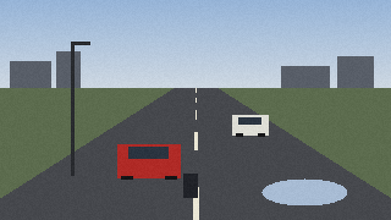
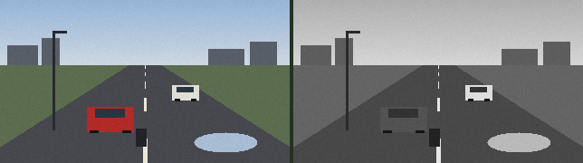
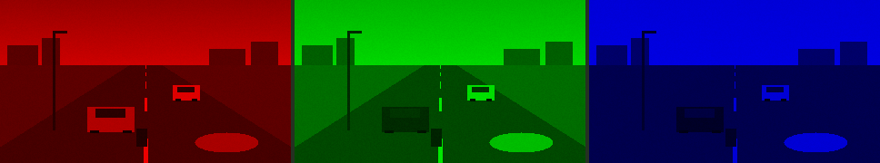
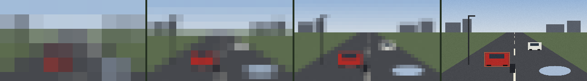

# 01 · Pictures are numbers · ภาพคือตัวเลข

> **In one sentence:** a camera turns light into a grid of numbers, and everything a computer "sees" starts — and, for a long while, ends — with those numbers.

[← Handbook](README.md) · Site: [/learn, chapter 1](https://vision.nonarkara.org/learn) · Run: `node examples/01-pixels.mjs`

---

## 1. What a camera actually records

A camera sensor is a grid of tiny light meters. Each one counts how much light landed on it during the exposure and stores that as a number. A colour sensor puts a red, green or blue filter over each meter, and software combines neighbours so that every position ends up with **three numbers: red, green, blue**, each from **0 (none) to 255 (as much as the format can hold)**.

That grid is a **picture element** grid — *pixels*. Our synthetic scene is 320 pixels wide and 180 tall:



```
320 × 180 = 57,600 pixels
57,600 × 3 = 172,800 numbers
```

A real 1080p traffic camera frame is 1920 × 1080 × 3 = **6,220,800 numbers**. At 25 frames per second that is over 155 million numbers every second. Computer vision is, first of all, the art of not drowning in them.

## 2. The numbers, for real

Here is what the example prints for four points in the scene:

```
sky          at (160, 10)  R=160 G=187 B=218  →  brightness 182.5
road         at (120,170)  R= 71 G= 73 B= 78  →  brightness 73.0
red car      at (100,138)  R=174 G= 40 B= 36  →  brightness 79.6
water patch  at (249,157)  R=168 G=188 B=212  →  brightness 184.8
```

And here is a 16 × 8 window at the red car's top-left corner, as brightness:

```
  75  75  68  71  74  70  71  72  70  69  71  71  70  69  73  69
  75  71  71  70  73  75  69  70  76  74  74  69  70  73  74  73
  69  71  73  70  70  71  73  69  70  73  74  68  73  74  71  74
  72  71  75  83  81  79  84  82  79  82  81  84  79  83  84  82
  74  70  70  79  81  86  81  85  80  86  81  78  84  80  86  80
  70  71  70  82  80  84  85  80  80  80  80  86  47  46  52  49
  72  76  73  80  85  84  83  85  79  82  81  85  52  50  52  52
  76  73  71  82  85  82  83  84  79  82  83  81  50  52  47  49
```

Read it slowly. Road (~70) on the top and left. The car body (~80) begins on row 4. The windscreen (~50) appears bottom right. **Nowhere in this table is the word "car".** A person looking at the picture sees a car instantly; the computer has only this. Every technique in this handbook is a way to get from a table like this one to a word like "car" — and to say how sure it is.

> **Try it on the site.** On [/learn](https://vision.nonarkara.org/learn), chapter 1 shows a live camera as this grid of numbers. Slide the control to the left: the squares grow, and once they are big enough each one prints its own brightness. The readout tells you how many numbers the grid holds against the full picture.

## 3. Three numbers become one: brightness

Many methods work on brightness alone. The usual formula (ITU-R BT.601, also what ffmpeg uses) weights green most, because human eyes are most sensitive to green:

```
brightness = 0.299 × R + 0.587 × G + 0.114 × B
```

Worked for the red car pixel: `0.299 × 174 + 0.587 × 40 + 0.114 × 36 = 52.0 + 23.5 + 4.1 = 79.6`.



The code is one line in [`public/js/cv/ops.js`](../public/js/cv/ops.js):

```js
export const luma = (r, g, b) => 0.299 * r + 0.587 * g + 0.114 * b
```

Hold on to this: **a red car (79.6) and the road (73.0) are almost the same brightness.** Chapter 02 shows what that costs.

## 4. Three channels

The same picture split into its red, green and blue channels (each shown in its own colour; the other two set to zero):



The red car is bright only in the red channel. The sky is bright in all three, brightest in blue. The grass is brightest in green. A colour is a *relationship* between three numbers, not a property of one.

## 5. Resolution: how many numbers you keep

Average each block of pixels into one value and you get a lower-resolution picture. From left: 32-pixel blocks, 16, 8, and the original (the red car boxed):



```
block 32 px → 10 × 6  = 60 numbers per channel
block 16 px → 20 × 12 = 240 numbers per channel
block  8 px → 40 × 23 = 920 numbers per channel
```

At 32-pixel blocks the cars are smudges; somewhere between 16 and 8 a person can tell what they are. **Detectors fail in the same place**: a car far down the road might be 10 pixels wide in a real frame, and there simply are not enough numbers to say "car". This is the single most common reason a camera "doesn't see" something — and the [/games](https://vision.nonarkara.org/games) "fewest pixels" game lets you race the detector at exactly this.

The site's `ops.pixelate(img, block)` is 20 lines; read it in [`ops.js`](../public/js/cv/ops.js).

## 6. Why this matters beyond the classroom

- **Storage and bandwidth.** 155 million numbers a second, per camera. Three things follow. Cameras compress (H.264/H.265). Analysis runs on small frames (the site's motion lens works at 192 pixels wide; the detector at 640). And a city cannot "just record everything in full".
- **Privacy is a resolution question.** A face 8 pixels tall cannot be recognised by anyone; a face 120 pixels tall can. How a system is configured — resolution, zoom, placement — decides what it *can* know, long before any AI is involved.
- **Every later step inherits these numbers.** Noise, compression blocks, glare and darkness are in the table before any model sees it. No model can recover information that was never recorded.

## Try it yourself · ลองทำเอง

**เป้าหมาย · Goal:** หาว่า "รถ" อยู่ตรงไหนในตารางตัวเลข และดูว่าช่องหยาบเกินไปทำให้เสียอะไร / Find where "car" lives inside a table of numbers — and watch what a too-coarse grid throws away.

**ขั้นตอน · Steps**

1. เปิด [/learn บท 1](/learn) แล้วตั้ง "จำนวนช่องตามแนวนอน" ไว้ที่ 16 — Open [/learn chapter 1](/learn) and set *Squares across* to 16.
2. หาตัวเลขที่สว่างที่สุดบนจอ แล้วเทียบกับตารางในบทนี้ (ถนนประมาณ 70 ท้องฟ้าประมาณ 180) — Find the largest number on screen and compare it with the table above: road ~70, sky ~180.
3. ลดเหลือ 6 ช่อง แล้วลองบอกตัวเองดูว่าภาพนี้คืออะไร — Drop to 6 squares and try to say what the picture shows.
4. ขึ้นไป 96 ช่อง แล้วอ่านตัวเลขรวมใน readout ว่าได้กี่ตัว — Go up to 96 squares and read the total count in the readout.

**ควรเห็น · You should see**

- ที่ 16 ช่อง ตัวเลขของถนนกับท้องฟ้าต่างกันชัดเจน แต่คำว่า "รถ" ไม่ได้อยู่ในตารางนั้นเลย — At 16 the road and sky numbers differ clearly, and the word "car" is nowhere in the grid.
- ที่ 6 ช่อง รูปร่างหายไปหมด เหลือเพียงบล็อกหยาบ ๆ — At 6 the shapes are gone; only coarse blocks remain.

**ถ้าไม่เห็น · If you do not** — ตัวเลขจะปรากฏก็ต่อเมื่อช่องใหญ่ (จำนวนน้อย) ถ้ายังไม่เห็น ให้เลื่อนไปทางซ้ายอีก / Numbers appear when the squares are large: slide further left.

## Check yourself

<details><summary>1. A frame is 640 × 360 pixels in colour. How many numbers is that?</summary>

640 × 360 × 3 = 691,200.
</details>

<details><summary>2. Pure yellow is R=255, G=255, B=0. What is its brightness?</summary>

0.299 × 255 + 0.587 × 255 + 0.114 × 0 = 225.4 — yellow is very bright, which is why it is used on warning signs.
</details>

<details><summary>3. Why does the computer not "know" that the window above is a car?</summary>

Because the numbers carry no label. "Car" is a conclusion someone (a person, or a model trained on people's labels) draws from patterns in many numbers at once. Nothing in a single pixel, or a small table of them, says what it belongs to.
</details>

---

### สรุปภาษาไทย

กล้องเปลี่ยนแสงเป็น **ตารางตัวเลข** แต่ละช่องเรียกว่า *พิกเซล* และมีตัวเลขสามตัวคือ แดง เขียว น้ำเงิน ตั้งแต่ 0 ถึง 255 ภาพตัวอย่างขนาด 320 × 180 มีตัวเลข 172,800 ตัว ส่วนกล้องจราจร 1080p มีมากกว่าหกล้านตัวต่อภาพ

เมื่อดูตัวเลขใต้รถสีแดง จะเห็นถนน (~70) ตัวรถ (~80) และกระจก (~50) แต่ **ไม่มีคำว่า "รถ" อยู่ในตัวเลขเลย** ทุกเทคนิคในคู่มือนี้คือวิธีเดินทางจากตารางตัวเลขไปถึงคำว่า "รถ" พร้อมบอกว่ามั่นใจแค่ไหน

ความสว่างคำนวณจาก 0.299R + 0.587G + 0.114B (ตาคนไวต่อสีเขียวที่สุด) และน่าสังเกตว่า **รถสีแดงกับถนนมีความสว่างใกล้กันมาก** บทที่ 2 จะแสดงว่าเรื่องนี้มีผลอย่างไร

ความละเอียดของภาพคือจำนวนตัวเลขที่เราเก็บไว้ ถ้าวัตถุอยู่ไกลจนเหลือไม่กี่พิกเซล ทั้งคนและเครื่องก็บอกไม่ได้ว่าคืออะไร และความละเอียดก็เป็นเรื่องความเป็นส่วนตัวด้วย ใบหน้าขนาด 8 พิกเซลไม่มีใครจำได้ แต่ขนาด 120 พิกเซลจำได้

**Next:** [02 · Light, colour and thresholds →](02-colour-and-thresholds.md)
