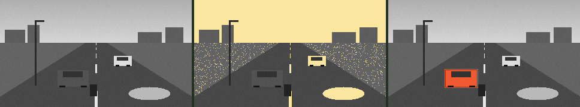

# 02 · Light, colour and thresholds · สี ความสว่าง และเกณฑ์

> **In one sentence:** the first decision a machine can make about a pixel is "bright or not?", and choosing the dividing number — and what to throw away to get there — is already a bet about the world.

[← 01](01-pictures-are-numbers.md) · [Handbook](README.md) · Site: [/learn, chapters 2–3](https://vision.nonarkara.org/learn) · Run: `node examples/02-threshold.mjs`

---

## 1. The histogram: a picture's fingerprint of light

Count how many pixels have each brightness from 0 to 255 and you get a **histogram**. For the scene (grouped into 16 bins):

```
  0– 15
 16– 31
 32– 47 ██
 48– 63 █
 64– 79 ██████████████████████████████████████████████████   ← road and ground
 80– 95 ██████████
 96–111 ██████████████████████████████████ ◀ threshold
112–127
  ...
160–175 ███
176–191 █████████████████████████████                         ← sky
192–207 ██████████████████████
208–223 ██████
224–239 █
```

Two hills: the dark road and grass, the bright sky. A histogram throws away *where* every pixel is and keeps only *how bright*. It is how cameras set exposure, how photo apps "auto-enhance", and how the next technique chooses its number.

## 2. Thresholding: one number, two classes

Pick a number *t*. Every pixel with brightness ≥ *t* is "on" (1); every other is "off" (0). That is the whole algorithm:

```js
// public/js/cv/ops.js
export function threshold(gray, t) {
  const out = new Uint8Array(gray.length)
  for (let i = 0; i < gray.length; i++) out[i] = gray[i] >= t ? 1 : 0
  return out
}
```

It is still everywhere: scanning documents (ink vs paper — see [Ekkasarn](https://scan.nonarkara.org) for a real Thai OCR pipeline — OCR being optical character recognition, turning a photo of text into text a computer can read), reading QR codes, counting cells under a microscope, finding a bright licence plate in a dark frame.

## 3. Otsu's method: let the data choose *t*

Nobuyuki Otsu (1979) asked: which *t* splits the histogram into two groups that are each as tight as possible and as far apart as possible? Formally, for every candidate *t* compute the **between-class variance**

```
σ²_between(t) = w_dark(t) · w_bright(t) · (μ_dark(t) − μ_bright(t))²
```

where *w* is the share of pixels in each group and *μ* its mean brightness — then pick the *t* where it is largest. For our scene, **t = 103**, which lands in the empty valley between the two hills. The site's implementation is 18 lines (`ops.otsu`), and the **Auto** button on /learn chapter 3 runs it on whatever camera you are looking at.



*Left: brightness. Middle: pixels at or above 103 (39.2% of the frame). Right: a colour rule, explained below.*

## 4. The red car that disappears

Look at the middle panel. The sky, the centre line, the white car and the water patch light up. **The red car does not.** The example measures why:

```
mean brightness, red car body: 81.6
mean brightness, road:         72.0
```

A bright red car is *dark* once colour is thrown away, because red contributes only 0.299 to brightness. Against dark asphalt, it all but vanishes. Now use colour instead — "how much redder than green is this pixel?":

```
mean "redness" (R − G, doubled), red car: 268.0   road: 0.0
A rule on redness > 120 finds 1 region: 52×28 at (96,118)
The answer key says the red car is      52×28 at (96,118).
```

A pixel-perfect find, from a rule a child could write. (On a real road, red brake lights, red signs and a red shirt would all trip it too — no single rule survives the real world for long. That is the argument for *learned* rules in chapter 05.)

> **The general lesson.** Every simplification a vision system makes — grayscale, low resolution, a fixed threshold — is a bet about what does not matter. Throwing colour away is cheap and usually harmless, until the thing you care about differs from its background *only* in colour. When a system fails, the first question is often: *what did it throw away?*

## 5. Why thresholds misbehave on real cameras

- **Light changes.** A threshold tuned at noon fails at dusk. Otsu re-chooses *t* per frame, which helps — but it always finds *some* split, even in a frame with nothing interesting in it.
- **One histogram, two meanings.** Two hills do not always mean "object vs background": in fog the hills merge; at night a few streetlights make a tiny bright hill that captures the split.
- **Local vs global.** One *t* for the whole frame cannot handle a frame that is half in shadow. *Adaptive thresholding* chooses *t* per neighbourhood instead — the standard fix in document scanning.

On /learn chapter 3 you can drag the threshold by hand, press Auto for Otsu, and watch both behaviours on a live road.

## 6. Colour spaces, briefly

RGB is how screens emit light, not how people describe colour. Vision systems often convert first:

| Space | Channels | Good for |
|---|---|---|
| RGB | red, green, blue | display; what the camera gives you |
| Gray (luma) | brightness | shape, edges, motion — cheap |
| HSV / HSL | hue, saturation, value | "find the red things" regardless of brightness |
| YCbCr | brightness + two colour-difference channels | video compression; keeps detail in Y |
| Lab | lightness + two opponent colours | measuring "how different do two colours look" |

The site stays in RGB and gray on purpose: everything is visible and explainable on one screen.

## Check yourself

<details><summary>1. A frame is all fog: one hill in the histogram. What threshold will Otsu choose, and is it meaningful?</summary>

It will still choose some value — the best split of a single hill, roughly through its middle. The result is a meaningless half-and-half mask. An algorithm that always answers is not the same as an algorithm that is always right; chapter 08 returns to this.
</details>

<details><summary>2. Why is a white car easy to find with a brightness threshold, but a red one hard?</summary>

White is bright in all three channels, so its brightness is high (~220). Red is bright only in R, which carries a 0.299 weight, so its brightness (~80) is close to asphalt (~72).
</details>

<details><summary>3. Write a rule that finds the water patch. What else would it catch?</summary>

Something like "brightness > 150 and B − R > 30 and below the horizon". On a real camera it would also catch a blue car, a wet reflective road under blue sky, and blue tarpaulin. FloodDash's water heuristic — FloodDash is the separate flood site by the same author that builds this site's camera list; the heuristic is credited in `ops.readFrame` — is deliberately labelled "consistent with standing water", never "flood".
</details>

---

### สรุปภาษาไทย

**ฮิสโทแกรม** คือการนับว่ามีพิกเซลความสว่างเท่าใดบ้าง ภาพถนนตัวอย่างมี "สองเนิน" คือถนนกับหญ้าที่มืด และท้องฟ้าที่สว่าง

**การกำหนดเกณฑ์ (threshold)** คือเลือกตัวเลขหนึ่งตัว พิกเซลที่สว่างกว่านั้นเป็น "1" ที่เหลือเป็น "0" วิธีของ **โอสึ (Otsu, 1979)** เลือกตัวเลขให้อัตโนมัติ โดยหาจุดแบ่งที่ทำให้สองกลุ่มแยกจากกันมากที่สุด ในภาพนี้ได้ 103 ซึ่งอยู่ตรงหุบระหว่างสองเนินพอดี

บทเรียนสำคัญ: **รถสีแดงหายไปเมื่อแปลงเป็นภาพขาวดำ** เพราะสีแดงมีน้ำหนักในความสว่างแค่ 0.299 จึงมืดพอ ๆ กับถนน (81.6 กับ 72.0) แต่ถ้าใช้กฎ "แดงกว่าเขียวเท่าไร" ก็หารถเจอตรงตำแหน่งพอดี ทุกครั้งที่ระบบลดทอนข้อมูล (ตัดสี ลดความละเอียด ใช้เกณฑ์ตายตัว) คือการเดิมพันว่าสิ่งที่ตัดทิ้งไม่สำคัญ เมื่อระบบผิดพลาด คำถามแรกคือ "มันตัดอะไรทิ้งไป"

**Next:** [03 · Convolution and edges →](03-convolution-and-edges.md)
