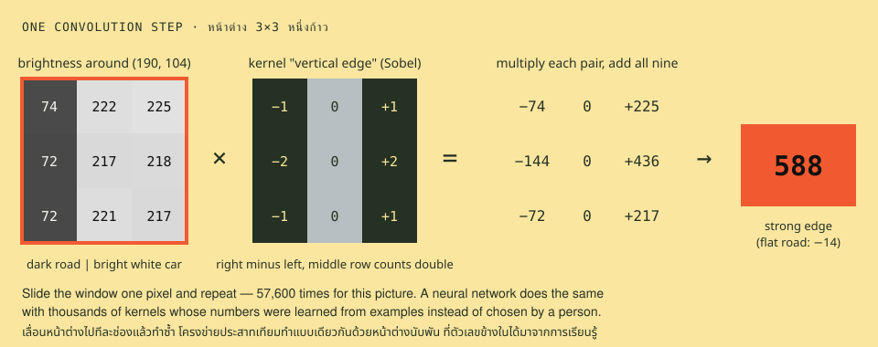
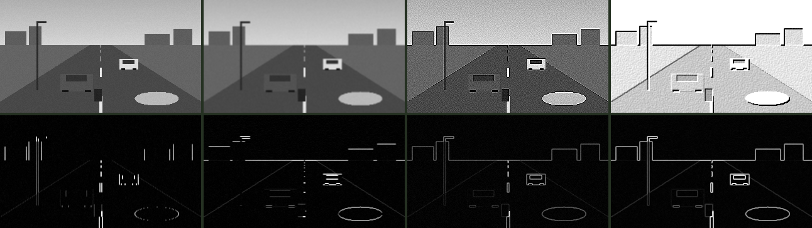
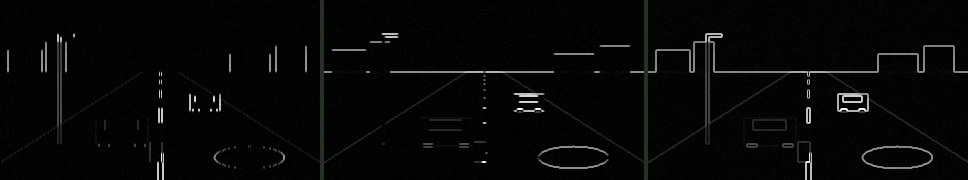

# 03 · Convolution and edges · หน้าต่างเลื่อนและขอบ

> **In one sentence:** slide a 3×3 window of weights over the picture, multiply and add at every position, and you can blur, sharpen or find edges — and a neural network is thousands of such windows whose weights were learned.

[← 02](02-colour-and-thresholds.md) · [Handbook](README.md) · Site: [/learn, chapters 4–5](https://vision.nonarkara.org/learn) · Run: `node examples/03-convolution.mjs`

---

## 1. One step, worked by hand

Take the pixel at (190, 104) — the left edge of the white car — and its eight neighbours. Multiply each by the matching number in a 3×3 **kernel**, then add all nine products:



```
neighbourhood (brightness)    ×   kernel "vertical edge"   =   products
   74  222  225                   -1   0   1                  -74     0   225
   72  217  218                   -2   0   2                 -144     0   436
   72  221  217                   -1   0   1                  -72     0   217

sum = 588
```

The kernel computes "right side minus left side" (middle row counted twice). Dark road on the left, bright car on the right: a big positive number — **a strong edge running up and down**. The same kernel on flat road at (110, 170) gives **−14**: no edge. Now slide the window one pixel to the right and repeat — 57,600 times for this picture. That full pass is a **convolution**, and the output is another picture.

The site's whole implementation:

```js
// public/js/cv/ops.js — every output pixel is the weighted sum of its 3×3 neighbourhood
export function convolve3(gray, width, height, k) {
  const out = new Float32Array(gray.length)
  for (let y = 0; y < height; y++) {
    const y0 = y > 0 ? y - 1 : 0, y2 = y < height - 1 ? y + 1 : y   // clamp at the border
    for (let x = 0; x < width; x++) {
      const x0 = x > 0 ? x - 1 : 0, x2 = x < width - 1 ? x + 1 : x
      out[y * width + x] =
        k[0] * gray[y0 * width + x0] + k[1] * gray[y0 * width + x] + k[2] * gray[y0 * width + x2] +
        k[3] * gray[y  * width + x0] + k[4] * gray[y  * width + x] + k[5] * gray[y  * width + x2] +
        k[6] * gray[y2 * width + x0] + k[7] * gray[y2 * width + x] + k[8] * gray[y2 * width + x2]
    }
  }
  return out
}
```

## 2. Seven kernels, seven effects

Same picture, same code — only the nine numbers change:

```
identity    [    0    0    0 |    0    1    0 |    0    0    0 ]   copy the pixel
blur        [ 0.11 0.11 0.11 | 0.11 0.11 0.11 | 0.11 0.11 0.11 ]   average the neighbourhood
sharpen     [    0   -1    0 |   -1    5   -1 |    0   -1    0 ]   exaggerate difference from neighbours
edges       [   -1   -1   -1 |   -1    8   -1 |   -1   -1   -1 ]   centre minus surroundings (Laplacian-like)
vertical    [   -1    0    1 |   -2    0    2 |   -1    0    1 ]   Sobel x: left↔right change
horizontal  [   -1   -2   -1 |    0    0    0 |    1    2    1 ]   Sobel y: top↔bottom change
emboss      [   -2   -1    0 |   -1    1    1 |    0    1    2 ]   a diagonal "relief" light
```



*Top row: identity · blur · sharpen · emboss. Bottom row: vertical edges · horizontal edges · "edges" kernel · Sobel magnitude. Edge outputs show their size (a dark→bright and a bright→dark edge both appear white).*

Notice:

- **Vertical** finds the lamp post and the car sides but misses the horizon; **horizontal** finds the horizon and car roofs but misses the post. Each kernel sees one direction.
- **Sharpen** brings out the sensor grain too. Every "enhancement" amplifies noise along with detail.
- The kernels' numbers **sum to 1** (identity, blur, sharpen) — brightness is preserved — or **to 0** (edge kernels) — flat regions go to zero, so only change survives.

On /learn chapter 4 you can switch kernels on a live camera and see the sum for the pixel under your cursor.

## 3. Sobel: edges in every direction

Combine the two directional kernels per pixel as the length of a vector:

```
edge strength = √( vertical² + horizontal² )
```



That is the **Sobel operator** (Irwin Sobel and Gary Feldman, 1968), still a default in image processing over half a century later. As text, from the example:

```
              @   @
           @  # @
  @@@@@@@@@@  # @                                                           @
          @@  * @                                        @         @        @
              #                   =          =
              #                =                =
              #             =                      =
              #          =                     @@    @
              %       =                        @         =
              %    :                   @@                   -
```

Outlines survive; flat regions vanish. The picture has become a drawing.

The famous next step, **Canny's edge detector** (1986), blurs first (to fight noise), takes Sobel, thins every edge to one pixel wide, and keeps weak edges only where they connect to strong ones. Edge maps like these powered most of computer vision until about 2012: lane detection, document boundaries, industrial inspection, and the "histogram of oriented gradients" features (Dalal & Triggs, 2005) behind the first good pedestrian detectors.

## 4. The bridge to deep learning

Everything above has one property: **a person chose the nine numbers.** Sobel picked −1, 0, 1, −2, 0, 2 by reasoning about derivatives. That works for edges. It does not scale to "wheel", "windscreen", "motorcycle helmet" — nobody can write those kernels by hand.

A **convolutional neural network** (CNN) keeps the sliding window and makes the numbers *learnable*:

| | Hand-made (this chapter) | Learned (chapter 05) |
|---|---|---|
| Kernel numbers | chosen by a person | adjusted by training on labelled examples |
| How many | 1–7 | tens of thousands across all layers |
| Stacked | rarely | 50+ layers, each convolving the last one's output |
| What they find | edges, blur | edges → textures → parts → objects |

Remarkably, when researchers look inside trained networks, the **first layer's learned kernels look like edge detectors** — the network rediscovers Sobel-like filters on its own, because edges are the most useful first thing to know about a picture (Zeiler & Fergus, 2014; also Hubel & Wiesel's 1959 finding that the cat visual cortex has cells that respond to oriented edges).

## Check yourself

<details><summary>1. Apply the "vertical" kernel to a neighbourhood that is 100 everywhere. What is the result? Why?</summary>

0. The kernel's numbers sum to zero, so on a flat region the positive and negative halves cancel. Edge kernels report change, not brightness.
</details>

<details><summary>2. Why does blur reduce the number of false edges?</summary>

Noise makes neighbouring pixels differ slightly at random, which edge kernels report as tiny edges. Averaging first (blur) smooths those random differences away, while a real edge — a large, consistent difference — survives. That is why Canny blurs before Sobel.
</details>

<details><summary>3. A 3×3 kernel has 9 weights. A CNN layer with 32 kernels over a colour (3-channel) input — how many weights?</summary>

Each kernel spans all input channels: 3 × 3 × 3 = 27 weights, plus 1 bias, for each of 32 kernels: 32 × 28 = 896. MobileNetV2's first layer has exactly this shape — 32 filters, 3×3, stride 2 — though it uses batch normalisation in place of the bias (864 kernel weights, plus normalisation parameters).
</details>

---

### สรุปภาษาไทย

**คอนโวลูชัน (convolution)** คือการเลื่อน "หน้าต่าง" ขนาด 3×3 ไปทีละพิกเซล ที่แต่ละตำแหน่งให้คูณตัวเลขในภาพกับตัวเลขในหน้าต่าง (เรียกว่า *เคอร์เนล*) แล้วบวกกันทั้งเก้าตัว ตัวอย่างที่ขอบซ้ายของรถสีขาวได้ผลรวม **588** (ขอบชัดมาก) ส่วนบนถนนเรียบได้ **−14** (ไม่มีขอบ)

เปลี่ยนแค่ตัวเลขเก้าตัว ภาพก็เปลี่ยนจากเบลอ เป็นคมชัด เป็นเส้นขอบแนวตั้ง แนวนอน **โซเบล (Sobel, 1968)** รวมสองทิศเป็นความแรงของขอบ ทำให้ภาพกลายเป็นภาพลายเส้น

สิ่งสำคัญที่สุด: ในบทนี้ **คนเป็นผู้เลือกตัวเลข** แต่ "ล้อรถ" หรือ "หมวกกันน็อก" ไม่มีใครเขียนเคอร์เนลด้วยมือได้ **โครงข่ายประสาทเทียมแบบคอนโวลูชัน (CNN)** ใช้หน้าต่างเลื่อนแบบเดียวกันนับหมื่นตัว แต่ตัวเลขข้างในได้มาจากการเรียนรู้จากตัวอย่าง และน่าทึ่งที่ชั้นแรกของโครงข่ายที่ฝึกแล้วมักเรียนรู้ตัวตรวจจับขอบขึ้นมาเองคล้ายโซเบล

**Next:** [04 · Motion →](04-motion.md)
