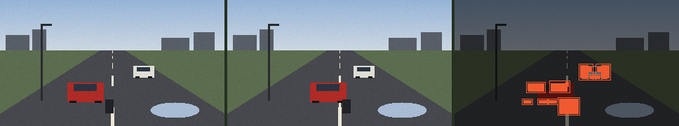

# 04 · Motion · การเคลื่อนไหว

> **In one sentence:** subtract the previous frame from this one, keep the pixels that changed by more than a threshold, join them into regions — and you have the plainest useful machine there is: one that never blinks.

[← 03](03-convolution-and-edges.md) · [Handbook](README.md) · Site: [/learn, chapter 6](https://vision.nonarkara.org/learn) · [/story](https://vision.nonarkara.org/story) · Run: `node examples/04-motion.mjs`

---

## 1. Why motion comes first

The idea behind this whole site began in city operations centres: a wall of hundreds of camera feeds, a few operators, and the plain fact that people blink, doze, text and take breaks. The first useful thing a machine can do there is not to *understand* a scene, but to **not miss that something changed** — and tap a human on the shoulder: *this screen, now*. No model, no names, no faces. Only "these pixels changed". The [/story](https://vision.nonarkara.org/story) room runs exactly this over six live cameras.

## 2. Three steps

```js
// public/js/cv/ops.js
const changed = ops.diffMask(previousGray, currentGray, delta)  // 1 where |Δ brightness| ≥ delta
const joined  = ops.dilate(changed, width, height)              // grow each spot by one pixel
const regions = ops.blobs(joined, width, height, minArea)       // connected regions → boxes
```

1. **Difference.** For every pixel, `|now − before|`. If it is at least `delta`, mark it 1.
2. **Dilate.** Grow every marked pixel into its 3×3 neighbourhood, so a car's broken outline becomes one shape.
3. **Connected regions.** Flood-fill each group of touching marked pixels; record its bounding box and area; drop groups smaller than `minArea` (noise).



*Left: t = 0. Middle: one second later. Right: changed pixels (Peach Red) and the regions found.*

The answer key says three vehicles moved:

```
car        x 96 → 118
car        x 190 → 180
motorcycle x 150 → 164
```

What the machine reports (delta = 18):

```
  #   box (x, y, w × h)      area
  1   (149, 141, 28 × 22)    616
  2   (137, 117, 26 × 14)    308
  3   (104, 119, 24 × 12)    287
  4   (203, 93, 18 × 20)     284
  5   (179, 93, 17 × 20)     276
  6   (192, 108, 16 × 5)      80
  7   (98, 143, 12 × 5)       60
  8   (120, 143, 12 × 5)      60
  9   (134, 143, 12 × 5)      60
```

**Nine regions for three vehicles.** A uniformly coloured car moving sideways changes only its leading and trailing edges — where it arrived and where it left; the middle of its body was red before and is still red now. Its wheels make their own little slivers. Differencing sees **change, not objects**. Counting objects from motion needs another step (merging nearby regions, tracking them over time) — or a detector (chapter 06).

## 3. The threshold is a bet against noise

Every real camera has grain: even a perfectly still scene changes by a few brightness levels between frames. So `delta` decides what counts as "real" change. The example compares two frames where **nothing moved** (only the noise is different) against two where the cars did:

```
delta  4:  nothing moved →  31.7% px changed,   1 region   ·   cars moved →  34.7% px,   1 region
delta  8:  nothing moved →   0.8% px changed,  60 regions  ·   cars moved →   4.3% px,  59 regions
delta 18:  nothing moved →   0.0% px changed,   0 regions  ·   cars moved →   2.5% px,   9 regions
delta 40:  nothing moved →   0.0% px changed,   0 regions  ·   cars moved →   1.2% px,   8 regions
delta 90:  nothing moved →   0.0% px changed,   0 regions  ·   cars moved →   0.7% px,   5 regions
```

- **delta 4:** grain flips a third of all pixels; they fuse into one frame-sized "region". Useless.
- **delta 8:** 60 false regions from noise alone — an alarm that never stops.
- **delta 18–40:** silence when nothing moves, a clear signal when something does. The sweet spot.
- **delta 90:** too strict — real things go missing. Which ones? The example can say exactly:

```
delta 18  motorcycle 28×22 · red car 26×14 · red car 24×12 · white car 18×20 · white car 17×20 · white car 16×5 · red car 12×5 · red car 12×5 · red car 12×5
delta 40  motorcycle 28×22 · white car 18×20 · white car 17×20 · white car 16×5 · red car 12×5 · red car 12×5 · red car 12×5 · red car 5×7
delta 90  white car 18×19 · white car 17×19 · motorcycle 6×17 · white car 16×4 · red car 5×7
```

At 18 the red car shows up as its dark windscreen (26×14, 24×12) and three wheel slivers (12×5). At 40 the windscreen is gone; at 90 one 5×7 sliver remains, and the motorcycle has shrunk to a strip.

The **red car** fades first, and even at 18 it is seen only through its windscreen and wheels: its body is almost exactly as bright as the asphalt it moves over (chapter 02's lesson again — 81.6 against 72.0). The white car, 150 levels brighter than the road, survives every threshold. **Motion detection is easiest for whatever contrasts most with the background** — which is not the same as whatever matters most.

The site's motion lens uses **22**; the /learn slider lets you move it from 4 to 80 on a live camera. Like every number in classical vision, it is *chosen, not learned* — and not perfect.

## 4. What breaks frame differencing in the real world

| Situation | What the machine reports | Why |
|---|---|---|
| Wind in trees, rain, flags | constant "motion" | they really are moving pixels |
| Camera shake on a pole | the whole frame changes | every pixel shifted |
| Clouds passing, lights switching on | large changes, no object | brightness changed everywhere |
| Video compression (H.264) | blocky flickers | keyframes and quantisation change pixel values |
| A traffic jam | "nothing moving" | stationary cars do not change |
| A fogged or dead lens | "nothing moving" | the picture does not change — **indistinguishable from an empty road** |

The last two are why this project never publishes a negative claim from motion. A positive finding — "something changed here" — is a claim about the **image**. A negative one — "the road is clear" — would be a claim about the **world**, and a frozen or fogged camera is pixel-identical to an empty road. FloodDash found exactly such a camera on 28 September 2026; its traffic detector had called the road "stopped".

## 5. From differencing to the real thing

Production systems improve each step:

- **Background models** — instead of the previous frame, compare against a slowly updated average of many frames (a "running average" or a *mixture of Gaussians* per pixel; Stauffer & Grimson, 1999). Waving trees become part of the background.
- **Optical flow** — estimate *where* each pixel moved, not just whether it changed (Lucas–Kanade, 1981; Horn–Schunck, 1981). Gives direction and speed.
- **Tracking** — link detections across frames into identities-over-time (the "same car" in frame 1 and frame 40), e.g. with a Kalman filter. This is where privacy questions sharpen: tracking an object is one step from tracking a person.

## Check yourself

<details><summary>1. A white car drives across a white wall. What does frame differencing see?</summary>

Very little — only the parts of the car whose brightness differs from the wall (windows, wheels, shadow). Differencing measures change in brightness, not the presence of an object.
</details>

<details><summary>2. Why does the /story wall flag only screens whose changed share exceeds 0.4%?</summary>

The same reason as delta: below a small share, change is likely noise or compression flicker. `ATTENTION_MIN_CHANGE = 0.004` in `public/js/story/wall.js` is a second threshold, on the area rather than the pixel.
</details>

<details><summary>3. A camera shows no motion for an hour. Name three different situations that would produce this.</summary>

An empty road; a total traffic jam; a frozen, fogged or disconnected camera. The pixels cannot tell them apart — which is why "no motion" is never published as "road clear".
</details>

---

### สรุปภาษาไทย

เครื่องจับการเคลื่อนไหวคือเครื่องที่ง่ายที่สุดแต่มีประโยชน์ที่สุด: **เอาภาพนี้ลบภาพก่อนหน้า** ตรงไหนเปลี่ยนเกินเกณฑ์ให้เป็น 1 ขยายจุดให้ต่อกัน แล้วรวมเป็นกลุ่ม ไม่ต้องมีโมเดล ไม่ต้องรู้ว่าใคร แค่รู้ว่า "ตรงนี้เปลี่ยน" นี่คือสิ่งที่ห้อง /story ใช้เฝ้ากล้องหกตัวพร้อมกัน เหมือนตาที่ไม่กะพริบในศูนย์ควบคุม

รถสามคันที่ขยับ เครื่องเห็นเป็น **เก้ากลุ่ม** เพราะรถสีเดียวกันทั้งคันเปลี่ยนแค่ขอบหน้าและขอบหลัง การลบภาพจึงเห็น "การเปลี่ยนแปลง" ไม่ใช่ "วัตถุ"

ค่าเกณฑ์ (delta) คือการเดิมพันกับสัญญาณรบกวน: ต่ำไป (4–8) เม็ดเกรนของกล้องกลายเป็น "การเคลื่อนไหว" สูงไป (90) ของจริงหายไป และสิ่งแรกที่หายคือ **รถสีแดง** เพราะสว่างพอ ๆ กับถนน ส่วนรถสีขาวยังเห็นทุกค่า การจับการเคลื่อนไหวจึงง่ายที่สุดกับสิ่งที่ต่างจากพื้นหลังมากที่สุด ซึ่งไม่ใช่สิ่งเดียวกับสิ่งที่สำคัญที่สุด เว็บไซต์ใช้ค่า 22

ข้อสำคัญที่สุด: **"ไม่มีการเคลื่อนไหว" ไม่เคยแปลว่า "ถนนว่าง"** เพราะรถติดนิ่ง กล้องค้าง หรือเลนส์ฝ้า ให้ภาพที่ไม่เปลี่ยนเหมือนกันทุกประการ ระบบนี้จึงเผยแพร่เฉพาะข้อค้นพบเชิงบวกเท่านั้น

**Next:** [05 · Neural networks →](05-neural-networks.md)
