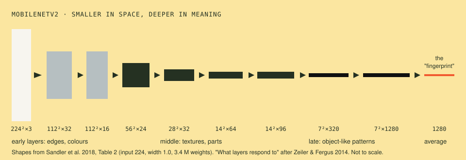

# 05 · Neural networks · โครงข่ายประสาทเทียม

> **In one sentence:** a neural network is many layers of convolutions whose numbers were found by showing it millions of labelled pictures and nudging every number, a little at a time, towards fewer mistakes.

[← 04](04-motion.md) · [Handbook](README.md) · Site: [/learn, chapter 7](https://vision.nonarkara.org/learn) · Code: [`public/js/ml/`](../public/js/ml/)

---

## 1. From chosen numbers to learned numbers

Chapters 01–04 used rules a person wrote: a brightness formula, a threshold, Sobel's nine numbers, a motion delta. They are transparent and they fail on anything their author did not anticipate. Nobody can write the kernel for "motorcycle helmet seen from behind at dusk".

The change that reshaped the field around 2012 was to keep the *structure* — sliding windows, stacked — and let the numbers be **learned**:

1. Start with random numbers in every kernel.
2. Show the network a labelled picture ("this is a car"). It outputs a score for every class — a class being one of the categories it may choose between (a car, a bus, a person; ImageNet has 1,000).
3. Measure how wrong it was (the **loss**).
4. Work out, for every one of its millions of numbers, which direction would have made it slightly less wrong (**backpropagation** computes this; Rumelhart, Hinton & Williams, 1986).
5. Move every number a tiny step in that direction (**gradient descent**).
6. Repeat for millions of pictures, many times over.

Chapter 07 does steps 2–6 in front of you, on one layer, in plain JavaScript — the loss curve on [/train](https://vision.nonarkara.org/train) is this process.

## 2. Why "deep": layers build on layers

Each layer convolves the previous layer's output. The first layer sees pixels; the second sees "where the first layer's edge detectors fired"; and so on. When researchers visualised what trained layers respond to (Zeiler & Fergus, 2014), a hierarchy appeared:

| Depth | Responds to | Example |
|---|---|---|
| layer 1 | edges, colour blobs | rediscovers Sobel-like filters (chapter 03) |
| layers 2–3 | corners, textures, simple patterns | mesh, stripes, tread |
| middle | parts | wheels, eyes, windows |
| late | object-like wholes | car fronts, faces, dog heads |

Nobody programmed this hierarchy. It emerged because it is the most useful way to turn pixels into labels.

## 3. The network on this site: MobileNetV2

The site runs **MobileNetV2** (Sandler et al., 2018) — designed at Google to be accurate enough while running on a phone.

Reading the shapes left to right (from the paper's Table 2): the 224 × 224 × 3 input is repeatedly halved in width and height while the number of channels grows — **less "where", more "what"** — until a 7 × 7 grid with 1,280 channels is averaged into **1,280 numbers**. Those 1,280 numbers are the network's summary of the whole picture: its *embedding*, or "fingerprint". A final layer turns them into scores for ImageNet's 1,000 classes.

| | MobileNetV2 1.0 · 224 |
|---|---|
| Weights | 3.4 million |
| Arithmetic per picture | ~300 million multiply-adds |
| Trained on | ImageNet: 1.28 million photos, 1,000 classes (Deng et al., 2009) |
| ImageNet top-1 accuracy (paper) | 72.0% |
| On this site | 14 MB of weights, self-hosted at `/models/mobilenet_v2_1.0_224/` |
| Used for | the 1,280-number fingerprint on /train (chapter 07) |

The site uses **only the fingerprint**, not the ImageNet guesses. `public/js/ml/embedder.js` can return the top guesses (`look(frame, { topk: 3 })`), but ImageNet's 1,000 English labels — more than a hundred of them dog breeds — say little useful about a Thai road, and we will not machine-translate them.

### The trick that makes it small: depthwise separable convolution

A normal convolution layer mixes space and channels at once: every output channel looks at a 3×3 window across **all** input channels. MobileNets (Howard et al., 2017) split this into two cheap steps:

1. **Depthwise:** one 3×3 kernel *per input channel* (space only).
2. **Pointwise:** a 1×1 convolution mixing channels (channels only).

For a 3×3 kernel this costs roughly **8–9× less arithmetic** for a small loss in accuracy. MobileNetV2 adds *inverted residuals* (expand channels ×6, filter, compress, and add the input back) and *linear bottlenecks* (no ReLU — the clamp-at-zero activation — on the compressed layer, which would destroy the information). That is how 3.4 million weights get to 72% on ImageNet — AlexNet (2012) used about 60 million to reach a lower accuracy.

## 4. How the detector reuses the same network

Object detection (chapter 06) uses MobileNetV2 again, as a **backbone**: the same layers produce feature grids at several scales, and small extra layers (the SSDLite "head") predict boxes and classes from them. One feature extractor, two jobs — the reason one family of networks serves both /learn and /train.

## 5. What "the network knows" — and does not

- **It knows statistics of its training photos**, not the world. ImageNet is mostly well-lit, centred, Western, consumer photography. A night-time Thai CCTV frame, shot from a pole, compressed, and wet, is far from that.
- **Confidence is not correctness.** A softmax score (raw scores squeezed into probabilities that add up to 1) of 0.9 means "this pattern resembled class X most among the classes I have", not "90% chance of being right". Networks can be confidently wrong, especially on inputs unlike their training data. (Calibration is its own research field.)
- **Small changes can flip answers.** Carefully chosen, nearly invisible pixel changes ("adversarial examples"; Goodfellow et al., 2014), or a printed sticker ("adversarial patch"; Brown et al., 2017) can make a network see what is not there. The "fool the machine" game on [/games](https://vision.nonarkara.org/games) lets you find gentler versions with your own camera.
- **It cannot say "I don't know"** unless designed to. A classifier always picks among its classes.

## 6. A short history (detailed in the [reading list](reference/reading-list.md))

| Year | Moment |
|---|---|
| 1959 | Hubel & Wiesel find edge-sensitive cells in the cat visual cortex |
| 1966 | MIT's "Summer Vision Project" expects to solve vision in a summer |
| 1980 | Fukushima's Neocognitron: layered, convolution-like, self-organising |
| 1986 | Backpropagation popularised (Rumelhart, Hinton & Williams) |
| 1998 | LeCun et al.: convolutional networks read handwritten cheques |
| 2009 | ImageNet: 14 million labelled images (Deng et al.); MobileNetV2 was trained on the 1,000-class, 1.28 million slice of them |
| 2012 | AlexNet wins ImageNet: top-5 error 15.3% vs 26.2% for the runner-up |
| 2015 | ResNet: 152 layers via residual connections (He et al.) |
| 2017–18 | MobileNets, MobileNetV2: deep vision fits on a phone |
| 2020 | Vision Transformers: attention instead of convolution (Dosovitskiy et al.) |
| 2021 | CLIP: learning from images paired with text (Radford et al.) |
| 2023 | Segment Anything: one model that outlines anything (Kirillov et al.) |

## Check yourself

1. Why does the picture get smaller in width and height but deeper in channels as it passes through MobileNetV2?

Each step trades location detail for meaning. Early on, knowing exactly where an edge is matters; by the end, the network needs to know *what* is present more than precisely where, and it needs many channels to represent many kinds of "what".

2. A classifier trained on dogs and cats is shown a car. What does it output?

Scores for "dog" and "cat" that sum to 1 — perhaps "cat 0.71". It has no way to say "neither" unless it was given such a class or a separate mechanism for detecting unfamiliar inputs.

3. Why can a 3.4-million-weight network beat AlexNet's ~60 million?

Better architecture: depthwise separable convolutions spend arithmetic where it matters, residual connections let deeper networks train, and years of improved training methods. Size is not the same as capability.

---

### สรุปภาษาไทย

**โครงข่ายประสาทเทียม** คือคอนโวลูชันหลายชั้นซ้อนกัน แต่ตัวเลขในทุกหน้าต่างไม่ได้มาจากคนเลือก มาจากการ **ฝึก**: เริ่มด้วยตัวเลขสุ่ม ให้ดูภาพที่มีป้ายกำกับ วัดว่าผิดแค่ไหน (loss) แล้วขยับตัวเลขทุกตัวไปในทิศที่ผิดน้อยลงทีละนิด (gradient descent) ทำซ้ำกับภาพนับล้าน

ชั้นต้น ๆ เรียนรู้ขอบและสี ชั้นกลางเรียนรู้พื้นผิวและชิ้นส่วน ชั้นท้ายเรียนรู้รูปร่างที่คล้ายวัตถุ ไม่มีใครโปรแกรมลำดับขั้นนี้ มันเกิดขึ้นเองเพราะเป็นวิธีที่ได้ผลที่สุด

เว็บไซต์ใช้ **MobileNetV2** (2018) ซึ่งมีน้ำหนัก 3.4 ล้านตัว ฝึกจากภาพ ImageNet 1.28 ล้านภาพ ภาพขนาด 224×224 ถูกย่อลงทีละครึ่งแต่มีช่องข้อมูลมากขึ้น จนเหลือ **ตัวเลข 1,280 ตัว** ที่เปรียบเหมือน "ลายนิ้วมือ" ของภาพ ห้อง /train ใช้ลายนิ้วมือนี้ ส่วนเครื่องตรวจจับวัตถุใช้โครงข่ายเดียวกันเป็นฐาน

ข้อควรจำ: โครงข่ายรู้แค่สถิติของภาพที่ใช้ฝึก **คะแนนความมั่นใจไม่ใช่ความถูกต้อง** การเปลี่ยนพิกเซลเล็กน้อยอาจทำให้คำตอบเปลี่ยน และมันพูดว่า "ไม่รู้" ไม่เป็น เว้นแต่จะถูกออกแบบมาให้พูดได้

**Next:** [06 · Object detection →](06-object-detection.md)
