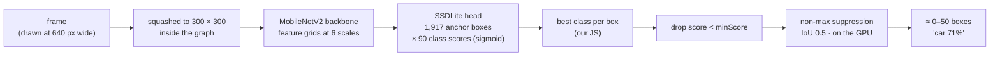
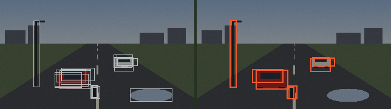

# 06 · Object detection · การหาวัตถุ

> **In one sentence:** a detector guesses thousands of boxes at once, keeps each box's best class and score, removes overlapping duplicates — and the confidence threshold you choose decides which mistakes you would rather make.

[← 05](05-neural-networks.md) · [Handbook](README.md) · Site: [/learn, chapters 7–8](https://vision.nonarkara.org/learn) · [/games](https://vision.nonarkara.org/games) · [/cameras census](https://vision.nonarkara.org/cameras) · Run: `node examples/05-detection-nms.mjs` · `node examples/06-precision-recall.mjs`

---

## 1. Classification vs detection

| Task | Question | Output |
|---|---|---|
| Classification (chapter 05) | *What is this picture of?* | one label for the whole picture |
| **Detection** (this chapter) | *What is where?* | many boxes, each with a label and a score |
| Segmentation | *Which pixels belong to what?* | a label per pixel |

A road frame contains many things; detection is what a traffic camera needs.

## 2. The detector on this site

**SSDLite + MobileNetV2, trained on COCO** — from the TensorFlow Object Detection model zoo, run by TensorFlow.js in your browser. Weights: 18 MB at `/models/ssdlite_mobilenet_v2/`. Code: [`public/js/ml/detector.js`](../public/js/ml/detector.js).

What happens to one frame (all verified against the model graph shipped in this repo):



**SSD** — *Single Shot MultiBox Detector* (Liu et al., 2016) — places a fixed set of **anchor boxes** of several sizes and shapes on grids of several resolutions, and for each anchor predicts (a) how to nudge the box to fit an object and (b) a score per class. One look ("single shot"), no separate region-proposal stage — which is why it is fast enough for a browser. **SSDLite** (Sandler et al., 2018) replaces SSD's normal convolutions with the cheaper depthwise separable ones from chapter 05: 4.3 million weights and about 0.8 billion multiply-adds, at 22.1 COCO mAP — one number standing in for a whole detector, unpacked in §4 — in the paper.

### The 300 × 300 squeeze, and why far-away things vanish

The graph resizes every input to **300 × 300**, ignoring aspect ratio (the constant is in the weights; read it yourself, it is `Preprocessor/map/while/ResizeImage/stack = (300, 300)`). For a 16:9 camera frame that means:

| | Width | Height |
|---|---|---|
| a 1080p frame | 1920 | 1080 |
| after the squeeze | 300 (÷ 6.4) | 300 (÷ 3.6) |
| a car 40 px wide, 24 px tall, far down the road | **~6 px** | ~7 px |

Six pixels wide is chapter 01's 32-pixel-block picture: a smudge. **Small, distant objects are the detector's main blind spot**, and the simulation in section 5 shows it in numbers.

## 3. Step by step: from 1,917 guesses to a few boxes

Run `node examples/05-detection-nms.mjs`. It uses simulated candidate boxes around the synthetic scene's answer key, so every number can be checked; the steps are the real ones.

**Step 1 — best class per box.** Each box gets 90 independent scores:

```
  car        ████████████████████████████   0.71
  truck      █████████                      0.22
  bus        ██                             0.06
  motorcycle █                              0.03
  person     █                              0.02
  …and 85 more classes, mostly near 0.
  → this box is reported as "car 71%". The 22% truck opinion is thrown away.
```

**Step 2 — minimum score.** Boxes below `minScore` are dropped. The site uses 0.3 for live lenses and the census, asks for everything above 0.10 on /learn chapter 7 (the slider then decides what you see), and 0.15 in the games so that "almost saw it" boxes can be shown in gray.

**Step 3 — non-maximum suppression (NMS).** A real object attracts many overlapping boxes. Sort by score; keep the best; drop any later box that overlaps a kept box by more than an **IoU** limit (0.5 here and on the site); continue.



### IoU — intersection over union

```
IoU(A, B) = area of overlap ÷ area covered by A or B together
```

```
  same size, shifted  0 px → IoU 1.00
  same size, shifted  5 px → IoU 0.82
  same size, shifted 13 px → IoU 0.60
  same size, shifted 26 px → IoU 0.33
  same size, shifted 52 px → IoU 0.00
```

The whole of NMS, as written in the example (it mirrors `tf.image.nonMaxSuppression`):

```js
export function nms(boxes, { iouLimit = 0.5, minScore = 0.3, max = 50 } = {}) {
  const sorted = boxes.filter((b) => b.score >= minScore).sort((a, b) => b.score - a.score)
  const kept = []
  for (const b of sorted) {
    if (kept.length >= max) break
    if (kept.every((k) => iou(k, b) <= iouLimit)) kept.push(b)
  }
  return kept
}
```

### What survives — scored the way benchmarks score it

Each real object may be claimed **once**, by the most confident box overlapping it with IoU ≥ 0.5. At `minScore = 0.3`:

```
  motorcycle  90%  correct — the motorcycle at x=150 (IoU 0.67)
  car         88%  correct — the car at x=190 (IoU 0.58)
  car         86%  WRONG — sloppy box on the car at x=96 (IoU 0.49 < 0.5)
  car         62%  WRONG — duplicate; the car at x=190 was already claimed
  car         52%  correct — the car at x=96 (IoU 0.84)
  person      34%  WRONG — nothing real there
  motorcycle  30%  WRONG — duplicate; the motorcycle at x=150 was already claimed
  → 3 of 3 real vehicles found, 4 wrong box(es)
```

Three lessons in seven lines:

1. **Duplicates survive NMS** when two boxes on one object overlap each other by *less* than the limit — common for small objects, where a few pixels of jitter is a large fraction of the box. A detector's count of cars is an *estimate*.
2. **"Sloppy" counts as wrong.** The 86% box really is on the red car, but too loosely (IoU 0.49). Benchmarks draw the line at 0.5; COCO also averages over stricter lines up to 0.95.
3. **The lamp post became a "person" at 34%.** Tall, thin, upright: to a network, a pattern resembling people. Raise `minScore` to 0.5 and it disappears — along with the correct 30%-and-below boxes on a harder day.

## 4. The confidence slider is a trade

`node examples/06-precision-recall.mjs` simulates a detector that, like real ones, is usually more confident about real objects than about false alarms, and worse at small objects. 200 real objects, 280 detector answers:

```
 threshold   shown   correct   false alarms   missed   precision   recall
   0.1        229      160          69         40        70%        80%
   0.3        199      160          39         40        80%        80%
   0.5        173      150          23         50        87%        75%
   0.7         99       90           9        110        91%        45%
   0.9         26       26           0        174       100%        13%
```

- **Precision** — of the boxes shown, how many are real? (*How often does it lie?*)
- **Recall** — of the real objects, how many were shown? (*How often does it miss?*)

Raise the threshold: fewer lies, more misses. **There is no threshold with neither.** The area under the whole precision–recall curve is **average precision** (here ≈ 74.8%); averaged over classes and IoU limits it is the **mAP** every detection paper reports.

And who gets missed, at 0.5:

```
small objects: 25 of 67 shown  (37%)
large objects: 125 of 133 shown  (94%)
```

That is the 300 × 300 squeeze from section 2, in numbers.

> **Why the site never says "no car".** At any threshold, recall is below 100% — and lowest for small, distant, dark or unusual objects. So "nothing detected above 30%" is a statement about the *picture and the model*, not about the road. Every place the site reports a detection result, it reports it that way.

## 5. Where detection appears on the site

| Room | What runs | Threshold |
|---|---|---|
| Home, lens 5 | detector on a live camera every ~0.7 s | 0.3 |
| /learn ch. 7 | detector with a confidence slider; list of everything above 10% | slider (0.1 floor) |
| /learn ch. 8 | the same detector at falling resolution — find where it breaks | 0.3 |
| /cameras census | one frame each from 12–48 cameras, 2 at a time, pause between | 0.3 |
| /games count race | you vs the detector, counting vehicles or people; you referee | your slider; boxes from 0.15 up to it are shown gray |
| /games fewest pixels | the detector guesses from a pixelated frame; it commits at ≥ 50% | 0.5 |
| /story | counts screens ("tv") and people in six control-room photos | — |

## 6. Beyond SSD (for the curious)

- **Two-stage detectors** — R-CNN (Girshick et al., 2014) → Faster R-CNN (Ren et al., 2015): first propose regions, then classify each. More accurate, slower.
- **YOLO** (Redmon et al., 2016): one network, one pass, a grid; the family most used in industry today. (Note for commercial use: several popular modern YOLO implementations are AGPL-licensed. The models on this site are Apache-2.0.)
- **Transformer detectors** (DETR, 2020) predict a set of boxes directly, no NMS.
- **Open-vocabulary detectors** (after CLIP, 2021) find objects named in free text, not just 80 fixed classes.

## Check yourself

<details><summary>1. Two cars park bumper to bumper; their true boxes overlap with IoU 0.55. What does NMS at 0.5 do?</summary>

It keeps the more confident box and suppresses the other — one car disappears. Crowded scenes (parking lots, jams, crowds) are where NMS undercounts; raising the limit helps there but lets more duplicates through elsewhere.
</details>

<details><summary>2. A flood-monitoring system must never miss a submerged car. Should its threshold be high or low? What does that cost?</summary>

Low — favour recall. The cost is many false alarms, so a human must review every alert. That is the right design for safety: the machine points, a person decides.
</details>

<details><summary>3. Why is "person 34%" on a lamp post not "a bug"?</summary>

Because the detector is doing what it was trained to: scoring how much a region resembles each class. A tall thin upright shape resembles people somewhat. The fix is a threshold suited to the task, more varied training data — and never treating a single detection as fact.
</details>

---

### สรุปภาษาไทย

**การตรวจจับวัตถุ** ตอบว่า "อะไรอยู่ตรงไหน" เครื่องตรวจจับบนเว็บไซต์คือ **SSDLite + MobileNetV2** ฝึกจากชุดข้อมูล COCO (80 ประเภท) ทุกภาพถูกบีบเป็น **300 × 300** ก่อนเข้าโครงข่าย รถที่อยู่ไกลซึ่งกว้าง 40 พิกเซลในภาพ 1080p จึงเหลือแค่ราว 6 พิกเซล นี่คือเหตุผลหลักที่ของเล็กหรือไกลมักหลุด

ขั้นตอน: โครงข่ายเดากล่อง **1,917 กล่อง** แต่ละกล่องมีคะแนน 90 ประเภท → เลือกประเภทที่คะแนนสูงสุด → ตัดกล่องที่คะแนนต่ำกว่าเกณฑ์ → **NMS** ลบกล่องที่ทับกันเกิน IoU 0.5 โดยเก็บกล่องที่มั่นใจที่สุดไว้

**IoU** คือพื้นที่ทับซ้อนหารด้วยพื้นที่รวม แม้หลัง NMS ก็ยังมีกล่องซ้ำและกล่องหลวม ๆ หลุดมาได้ จำนวนรถที่เครื่องนับได้จึงเป็น "ค่าประมาณ"

**แถบความมั่นใจคือการแลกเปลี่ยน**: เกณฑ์สูง = โกหกน้อย (precision สูง) แต่พลาดมาก (recall ต่ำ) เกณฑ์ต่ำ = กลับกัน **ไม่มีค่าไหนที่ไม่ผิดเลย** และสิ่งที่พลาดมากที่สุดคือวัตถุเล็ก (เห็นแค่ 37% เทียบกับวัตถุใหญ่ 94%) เว็บไซต์จึงไม่เคยพูดว่า "ไม่มีรถ" พูดได้แค่ว่า "ไม่พบอะไรที่มั่นใจเกิน 30%"

**Next:** [07 · Teaching a machine →](07-transfer-learning.md)
