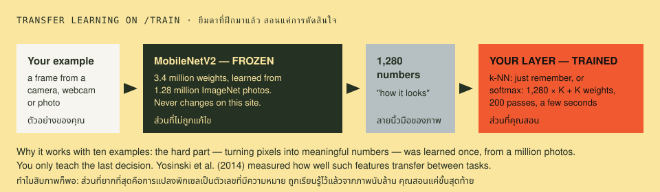
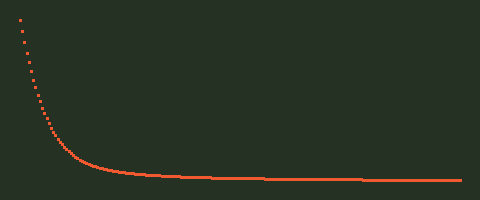
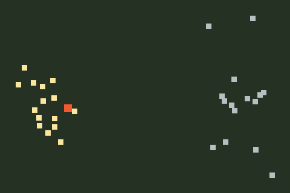

# 07 · Teaching a machine · สอนเครื่องด้วยตัวเอง

> **In one sentence:** borrow a network that already turns pictures into meaningful numbers, then teach only the last decision from a handful of your own examples — and watch out for the machine learning the wrong lesson.

[← 06](06-object-detection.md) · [Handbook](README.md) · Site: [/train](https://vision.nonarkara.org/train) · Run: `node examples/07-transfer-learning.mjs` · Code: [`public/js/ml/learner.js`](../public/js/ml/learner.js), [`public/js/train/`](../public/js/train/)

---

## 1. The idea: transfer learning

Training a network like MobileNetV2 from scratch took 1.28 million labelled photos and a great deal of computing. You have ten photos and a browser. The trick is to **reuse** the expensive part:



- **Frozen:** MobileNetV2 turns any frame into 1,280 numbers — its "fingerprint" of how the picture looks (chapter 05). It never changes on this site.
- **Trained:** a tiny decision on top of those numbers, learned from *your* examples, in seconds.

Why this works: the features a network learns on one large task are useful for many others, especially the early and middle ones (measured by Yosinski et al., 2014). "Busy road vs empty road" is a new question, but it is asked of the same kinds of edges, textures and shapes.

## 2. What /train lets you do

1. **Pick a challenge** — two to four classes. Presets for your own camera: *A / B*, *Hand up / Hand down*, *Cup / No cup*, *Someone there / Nobody*, *Rock / Paper / Scissors*. Presets for public cameras: *Busy / Empty road*, *Rain, wet road / Dry road*, *Day / Night*. Or name your own.
2. **Add examples** — click, or hold to record, from your webcam, a public camera or a photo. Up to 100 per class. Click a thumbnail to throw a bad example away.
3. **Watch it learn** — a nearest-neighbour learner answers immediately; a trained layer runs 200 passes with a live loss curve; a 2-D map shows your examples as clouds.
4. **Judge the country** — freeze what you taught and run it on 24 public cameras it has never seen, one at a time, politely. Answers below 70% are marked *unsure*.
5. **Keep it** — download the trained layer as a small JSON file (JSON is the plain-text format programs use to exchange data; format `vision.nonarkara.org/train-layer`), load it again later.

Nothing is uploaded at any step. Examples live in the tab's memory and vanish on reload — by design, and the page says so.

There is deliberately **no "me / not me" preset**: this site does not teach anyone to recognise a person. *Someone there / Nobody* asks only whether a person is in view.

## 3. Learner one: nearest neighbours (no training at all)

Remember every example's 1,280 numbers. For a new frame, find the *k* most similar examples and let them vote (the site uses *k* = 5). Similarity is the **cosine**: after scaling every fingerprint to length 1, the **dot product** — multiply the numbers sitting in matching places, then add them up. 1 means "points the same way", 0 means "unrelated".

```js
// public/js/ml/learner.js (abridged)
export function knnPredict(samples, x, classes, k = 5) {
  const sims = samples.map((s, i) => ({ i, sim: dot(s.x, x), y: s.y }))   // x and s.x are normalised
  sims.sort((a, b) => b.sim - a.sim)
  const top = sims.slice(0, Math.min(k, sims.length))
  const votes = new Array(classes).fill(0)
  for (const n of top) votes[n.y] += Math.max(0, n.sim) + 1e-6           // closer neighbours count more
  const total = votes.reduce((a, b) => a + b, 0)
  return { probs: votes.map((v) => v / total), neighbours: top }
}
```

From the example (simulated fingerprints):

```
A new river camera picture. Its 5 most similar examples (cosine similarity, 1 = identical):
  example # 1  river camera  similarity 0.691
  example # 4  river camera  similarity 0.689
  example # 0  river camera  similarity 0.686
  example # 2  river camera  similarity 0.682
  example # 3  river camera  similarity 0.672
Vote → river camera 100% · road camera 0%
```

"Training" here is just remembering — which is why /train answers the moment you add a single example. On the page, thin lines on the map run from the live frame to the examples it is listening to.

### How many examples?

Hide each example in turn and predict it from the rest (**leave-one-out**; the /train readout reports this as you add examples):

```
  per class    k = 1 (closest one decides)       k = 5 (five closest vote)
     1          0%                              0%
     2         75% ███████████████              0%
     3         83% █████████████████            0%
     5         88% ██████████████████          80% ████████████████
    10         81% ████████████████            84% █████████████████
    20         87% █████████████████           89% ██████████████████
    40         88% ██████████████████          88% ██████████████████
```

- One per class never works: the hidden example's class has nobody left to vote.
- **k = 5 with three or fewer per class fails outright** — the other class always has more voters. Give each class at least five examples on /train.
- After that, more examples help with diminishing returns. **Variety beats volume**: ten examples from ten different cameras teach more than a hundred from one.

## 4. Learner two: a trained layer

One layer of weights — 1,280 inputs × *K* classes + *K* biases (2,562 numbers for two classes) — turned into probabilities by **softmax**, adjusted by **gradient descent** to reduce **cross-entropy loss**:

```
score_c   = b_c + Σ_i W[c, i] · x_i              for each class c
p_c       = e^(score_c) / Σ_k e^(score_k)         softmax: scores → probabilities that sum to 1
loss      = −log p_(correct class)               0 when certain and right; large when confidently wrong
each pass: W ← W − step × ∂loss/∂W                 (Adam chooses the step per weight; Kingma & Ba, 2014)
```

Read the symbols: `Σ_i` means *add up over all 1,280 inputs*; `W[c, i]` is the weight joining input *i* to class *c*; `b_c` is that class's bias (the extra shift-only number from chapter 03); and `∂loss/∂W` is the slope that says which way each weight must move to make the loss smaller.

`createLayer()` in `learner.js` implements exactly this in ~70 lines of plain JavaScript — no TensorFlow. The site runs 200 passes, at most two per animation frame, so you can *watch* the curve fall (the readout reports the real arithmetic time separately; it is milliseconds).

```
cross-entropy loss per pass (200 passes)
  0.693 │•
  0.542 │ •
  0.466 │  •
  0.315 │   •
  0.239 │    ••
  0.163 │      •
  0.087 │       •••••••
  0.012 │              ••••••••••••••••••••••••••••••••••••••••••••••
        └────────────────────────────────────────────────────────────
first loss 0.693 → last 0.012 · accuracy on 80 NEW examples: layer 100%, k-NN 88%
```



Why does it start at **0.693**? That is −log(0.5): with random small weights the layer gives each of two classes 50%. Why does the layer beat k-NN here? Training taught it **which** of the 1,280 numbers separate the classes; k-NN weighs all of them equally, noise included.

## 5. The map: 1,280 numbers squeezed to 2

People cannot see in 1,280 dimensions. **Principal component analysis** (PCA) finds the two directions along which the examples differ most and projects onto them. `pca2()` uses the Gram-matrix trick. With N examples of D numbers — and N ≪ D, meaning far fewer examples than numbers — it works with the N×N matrix of dot products instead of the much larger D×D covariance matrix. Same leading directions, far less arithmetic.



Two separate clouds mean the classes look different to the network. The map is a **shadow**: two points close here can be far apart in 1,280 dimensions, and the page says so under the picture.

## 6. The trap: shortcut learning

The example's last section is the most important lesson in applied computer vision. Train *river* examples that were all taken **at night** and *road* examples all **by day**:

```
trained on: rivers-at-night vs roads-by-day   → training accuracy 100%
tested on:  rivers and roads, same lighting   → 50%
tested on:  rivers by day vs roads at night   → 0%
```

A perfect score on its own examples. A coin toss on fair data. **Exactly wrong** when the lighting flips. The layer learned "dark = river" — the easiest difference in the data, not the one you meant. It happens in real systems:

- a skin-cancer classifier whose decisions were swayed by **surgical ink markings** around lesions (Winkler et al., *JAMA Dermatology*, 2019);
- pneumonia models that partly learned **which hospital** took the X-ray (Zech et al., *PLOS Medicine*, 2018);
- a broad survey: Geirhos et al., "Shortcut learning in deep neural networks" (2020).

**On /train, try it yourself:** teach *Cup / No cup* with the cup always on the left of the frame, then move it right. Or teach *Day / Night* from one camera and judge the country.

The cure is not a bigger model. It is examples that **vary the things that should not matter** — lighting, camera, angle, background, season — and testing on data collected differently from the training data.

## 7. From a classroom to a product

What /train does is the core of commercial "custom vision" services. What a real product adds (see the [blueprint](system/cvaas-blueprint.md)):

- **Active learning** — show the cases the model is least sure about, let a person correct them, retrain. (/train's judge marks *unsure* answers; correcting them back into the examples is the natural next feature.)
- **Held-out evaluation** — never measure on the examples you trained on.
- **Versioning** — which examples produced which model, so a bad decision can be traced.
- **Drift monitoring** — cameras get dirty, seasons change; accuracy decays unless measured.

## Try it yourself · ลองทำเอง

**เป้าหมาย · Goal:** สอนเครื่องจำสองกลุ่มด้วยภาพไม่กี่ภาพ แล้วจับทางลัดที่มันใช้ / Teach it two groups with a few pictures, then catch the shortcut it is using.

**ขั้นตอน · Steps**

1. เปิด [/train](/train) เพิ่มภาพให้สองกลุ่ม กลุ่มละประมาณ 6 ภาพจากกล้องของคุณ — Open [/train](/train) and add about six pictures to each group from your camera.
2. กด "ฝึกและลอง" แล้วดูแถบสองอัน: แถบบนเดาได้ทันทีจากตัวอย่างที่คล้ายกัน แถบล่างใช้ได้หลังกดฝึก — Press *Train and try it* and watch the two bars: the top one guesses right away from similar examples, the bottom one only after training.
3. ถ่ายภาพใหม่ที่ไม่ได้ใส่ตอนฝึก แล้วเทียบคำตอบของทั้งสองแถบ — Take a fresh picture you never added and compare what the two bars say.
4. ลองสร้างทางลัด: ให้ทุกภาพของกลุ่มแรกมีพื้นหลังหรือแสงเดียวกัน ฝึกใหม่ แล้วย้ายพื้นหลัง — Build a shortcut: give every picture of group one the same background or lighting, retrain, then change the background.

**ควรเห็น · You should see**

- แถบบนทำงานตั้งแต่ยังไม่ได้กดฝึก เพราะมันคือ k-NN กับลายนิ้วมือ 1,280 ตัวเลข — The top bar works before you train: it is k-NN over the same 1,280-number fingerprint.
- พอตัดทางลัด (ย้ายพื้นหลัง) คะแนนร่วง ทั้งที่วัตถุยังเป็นวัตถุเดิม — Remove the shortcut and the score falls, even though the object never changed.

**ถ้าไม่เห็น · If you do not** — สองกลุ่มเหมือนกันเกินไปหรือภาพน้อยเกินไป ให้เพิ่มภาพ หรือเลือกสิ่งที่ต่างกันชัดกว่า — If both bars sit at 50/50 the groups are too alike or too few: add pictures, or pick things that differ more.

## Check yourself

<details><summary>1. You teach Busy road / Empty road using one camera at 8 am (busy) and 3 am (empty). What did the model probably learn?</summary>

Day vs night. Every busy example is bright, every empty one dark. Judge the country at noon and every empty road will be called "busy". Collect both classes at the same times of day, from many cameras.
</details>

<details><summary>2. Why does k-NN need no "training" step, while the layer does?</summary>

k-NN defers all work to prediction time: it compares the new fingerprint with every stored one. The layer compresses the examples into 2,562 numbers ahead of time, which is what the 200 passes do — and why it can generalise better and predict faster.
</details>

<details><summary>3. The downloaded layer file contains weights, not pictures. Can someone recover your photos from it?</summary>

Not the photos themselves — the file holds 1,280 × K weights and K biases, summaries of many examples. But treat model files as derived from your data: they can leak *something* about it (research on "model inversion" and "membership inference" shows this for larger models). For a small layer trained on your own room, the practical risk is low; for faces or medical images it would not be.
</details>

---

### สรุปภาษาไทย

**การเรียนรู้แบบถ่ายโอน (transfer learning)** คือการยืมโครงข่ายที่ฝึกมาแล้ว (MobileNetV2 จากภาพ 1.28 ล้านภาพ) ให้แปลงภาพเป็น **ตัวเลข 1,280 ตัว** แล้วสอนแค่ "การตัดสินใจขั้นสุดท้าย" ด้วยตัวอย่างไม่กี่ภาพของคุณ ห้อง /train ทำทั้งหมดในเบราว์เซอร์ ไม่มีอะไรถูกอัปโหลด

สองวิธีเรียน: **เพื่อนบ้านใกล้สุด (k-NN)** แค่จำตัวอย่างไว้ แล้วให้ตัวอย่างที่คล้ายที่สุด 5 ตัวโหวต (ตอบได้ทันทีตั้งแต่ตัวอย่างแรก แต่ต้องมีอย่างน้อย 5 ภาพต่อกลุ่ม) และ **ชั้นที่ฝึก (softmax)** ปรับน้ำหนัก 2,562 ตัว 200 รอบ จนค่าความผิดพลาด (loss) ลดจาก 0.693 เหลือเกือบศูนย์ ซึ่งมักทำนายได้ดีกว่าเพราะเรียนรู้ว่าตัวเลขไหนสำคัญ

**กับดักที่สำคัญที่สุด: การเรียนทางลัด (shortcut learning)** ถ้าภาพ "แม่น้ำ" ทั้งหมดถ่ายตอนกลางคืน และ "ถนน" ถ่ายตอนกลางวัน เครื่องจะเรียนรู้ว่า "มืด = แม่น้ำ" ได้คะแนน 100% กับตัวอย่างของตัวเอง แต่เหลือ 50% กับข้อมูลที่ยุติธรรม และ 0% เมื่อสลับแสง เรื่องนี้เกิดจริงในการแพทย์ ทางแก้ไม่ใช่โมเดลที่ใหญ่ขึ้น แต่คือตัวอย่างที่ **หลากหลายในสิ่งที่ไม่ควรสำคัญ** เช่น แสง มุมกล้อง ฉากหลัง

**Next:** [08 · Limits and ethics →](08-limits-and-ethics.md)
