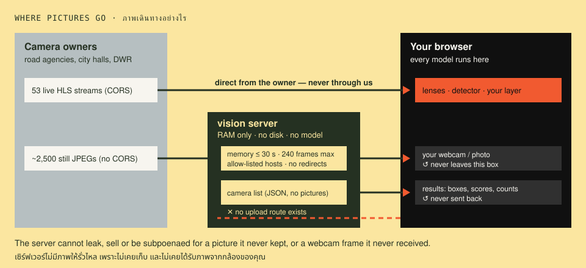

# 08 · Limits and ethics · ข้อจำกัดและจริยธรรม

> **In one sentence:** a vision system's answers are guesses about pictures, not facts about the world; it fails most where conditions are worst; and what it is *allowed* to see is decided by design choices made long before any model runs.

[← 07](07-transfer-learning.md) · [Handbook](README.md) · Site: [/learn, chapter 8](https://vision.nonarkara.org/learn) · [/legal](https://vision.nonarkara.org/legal) · Run: `node examples/08-catalogue.mjs`

---

## 1. The honesty rule

This project inherits one rule from [FloodDash](https://flood.nonarkara.org), and every room follows it:

> **A positive finding is a claim about the image. A negative finding would be a claim about the world — and we do not publish those.**

"A car, 71%" says: *in these pixels, a pattern resembling a car scored 0.71*. Publishable. "No cars" would say: *the road is empty*. But chapters 04 and 06 showed that a jammed road, a fogged lens, a frozen feed, a car too small to resolve and a car the model has never seen all produce the same silence. So the site only ever says "nothing detected above *N*%" — and the readouts explain why.

## 2. Where it fails: a field guide

| Condition | What happens | Chapter |
|---|---|---|
| **Small or distant objects** | squeezed to a few pixels at 300 × 300; recall 37% vs 94% for large ones in the simulation | 01, 06 |
| **Night, low light** | sensor noise rises, contrast and colour vanish; detector confidence collapses | 02 |
| **Fog, rain on the lens, glare** | everything washes toward one gray; thresholds and edges lose their grip | 02, 03 |
| **Crowds, traffic jams** | boxes overlap; NMS merges neighbours; counts fall | 06 |
| **Unusual objects** | a *tuk-tuk*, a *song-thaew*, a cart: COCO has no class for them, so they become "car", "truck" or nothing | 06 |
| **Things that look like other things** | lamp post → "person 34%"; puddle → "boat" | 06 |
| **Wrong lesson learned** | "dark = river": 100% on training, 0% when lighting flips | 07 |
| **Deliberate attack** | adversarial stickers and patterns can make objects appear or vanish | 05 |
| **No pixels at all** | a third of listed cameras cannot be read by any machine here | below |

On /learn chapter 8 you can lower the resolution of a live camera step by step and watch the detector's answers degrade; on /games, "fool the machine" lets you find failures with your own camera.

## 3. The first limit is plumbing, not AI

Before any model runs, a city-scale system must be *able* to see. A sample run of `node examples/08-catalogue.mjs` (the counts move by tens a day; run it for today's):

```
video     53  live video from a host that allows reading (CORS)
still   2675  a still JPEG without CORS — relayed through server memory
view     857  viewable only on the owner's own page — no machine here can read its pixels
off      477  the owner's stream was found down by FloodDash's health probe

67% of listed cameras are machine-readable IN PRINCIPLE. In practice fewer: on
one sample, only 22 of 40 cctv.maholan.net stills answered (the rest 502).
```

Of ~4,000 public cameras, one in three offers no readable pixels; many of the rest answer intermittently; about 50 offer live video a browser may analyse. **Coverage, uptime and permission bound what any vision system can know — long before accuracy does.** When someone presents a "city-wide AI camera network", the first questions are: how many cameras, readable how often, with whose permission?

## 4. Bias: who the errors fall on

Errors are never evenly spread. The best-known measurement, *Gender Shades* (Buolamwini & Gebru, 2018), tested commercial gender classifiers on faces: error rates were as low as **0.8%** for lighter-skinned men and as high as **34.7%** for darker-skinned women. The models were not "biased" by intent; their training data and benchmarks under-represented some people, and nobody had measured.

For road cameras the same mechanism applies to places, not just people:

- COCO's photos are mostly from Flickr; few are Thai roads, Thai vehicles or Thai weather.
- Cameras are densest in Bangkok (see the text map in `08-catalogue.mjs`); a "national" count is mostly a Bangkok count.
- A detector that misses motorcycles in rain undercounts exactly the people most exposed in a flood.

**What to do about it:** measure accuracy *separately* for the conditions and places that matter (night, rain, provinces, vehicle types), publish those numbers, and keep a human in the loop where errors cause harm.

## 5. Privacy by architecture

A promise in a policy can be broken quietly. An architecture that cannot do the thing is a stronger promise. This site's choices (detail in [system/architecture.md](system/architecture.md)):



| We do not… | Because the design… |
|---|---|
| store camera imagery | relays stills from memory (≤ 30 s, never disk); live video never touches our server |
| receive your webcam or photos | runs every model in your browser; there is no upload endpoint |
| recognise faces or read number plates | ships no such model; the only "person" output is a COCO class count |
| track individuals across frames or cameras | keeps no identities, no history, no cross-camera linkage |
| profile visitors | has no accounts, cookies or analytics; IP addresses live briefly in memory for rate limits only |

What we deliberately **refused to build**, even though it would be easy: face recognition, licence-plate reading, person re-identification, a "find this person on every camera" search, and a "me / not me" training preset.

## 6. Thailand's PDPA, as it bears on computer vision

*Not legal advice. The site's own position is on [/legal](https://vision.nonarkara.org/legal).*

The Personal Data Protection Act B.E. 2562 (2019) came fully into force on 1 June 2022. Questions any vision system in Thailand must answer:

| Section | What it says (summarised) | Why it matters for CV |
|---|---|---|
| s.6 | "personal data" is information that identifies a person **directly or indirectly** | a clearly visible face is personal data even if no name is known |
| s.19, s.24 | processing needs consent or another lawful basis | "the camera is public" is not by itself a lawful basis |
| s.25 | collecting from a source other than the person is restricted | a camera feed is exactly that: we are downstream of everyone in frame |
| **s.26** | **sensitive data**, including **biometric data**, needs explicit consent or a narrow exception | **face recognition processes biometric data** — one concrete reason this site does not do it |
| s.4 | lists activities the Act does not apply to (e.g. some public-benefit, media and research uses), while still requiring security | exemptions are narrow and conditional; read them with a lawyer |

Beyond the PDPA: the Criminal Code's s.309/1 (repeatedly watching or tracking a person so as to disturb their ordinary life) reaches *users* of camera systems, and the Computer-Related Crime Act covers scraping and attacks. This is why /legal asks every visitor not to identify, follow or profile anyone.

## 7. Questions to ask any vision system (a checklist)

For a city, an agency, or anyone being sold "AI cameras":

1. **What exactly does it output** — boxes, counts, identities, alerts? Who sees them?
2. **What is its measured precision and recall**, in *our* conditions: night, rain, our vehicles, our provinces? Who measured it?
3. **What does "nothing detected" trigger?** Anything that treats silence as safety is dangerous.
4. **Where do pictures go, how long are they kept, who can access them?** Is that enforced by architecture or by policy?
5. **Does it process biometric data** (faces, gait)? Under what lawful basis?
6. **Who reviews its alerts before action is taken?** What is the appeal route for a person affected?
7. **How is drift detected** — dirty lenses, new vehicles, seasonal change?
8. **Can it be switched off per camera**, and can a camera owner or a citizen ask for that?

## Check yourself

<details><summary>1. A system reports "0 people in the flood zone" at 2 am. What can you conclude?</summary>

Only that no region scored above the threshold as "person" in the frames analysed. At night, at distance, in rain, recall is at its worst. It is not evidence that nobody is there — and must never be used to stand down a rescue.
</details>

<details><summary>2. Why is "the camera is already public" not enough to justify face recognition on it?</summary>

Because recognition creates new, sensitive data (biometric identity) that the original public view did not: it turns "someone walked past" into "this named person was here at 14:02". Under the PDPA biometric data is sensitive (s.26); ethically, it enables tracking that a passer-by never consented to.
</details>

<details><summary>3. Name one design choice on this site that protects privacy without relying on anyone's good behaviour.</summary>

Any of: running models in the browser (no upload path exists); relaying stills from memory only; shipping no face or plate model; no accounts or analytics.
</details>

---

### สรุปภาษาไทย

**กฎความซื่อตรง:** สิ่งที่เครื่อง "เห็น" คือข้อสรุปเกี่ยวกับภาพ เผยแพร่ได้ แต่ "ไม่เห็น" จะกลายเป็นข้อสรุปเกี่ยวกับโลก ซึ่งเราไม่เผยแพร่ เพราะรถติดนิ่ง เลนส์ฝ้า กล้องค้าง หรือรถที่เล็กเกินไป ล้วนให้ความเงียบแบบเดียวกัน

**จุดที่ระบบพลาด:** วัตถุเล็กหรือไกล กลางคืน หมอก ฝนบนเลนส์ ฝูงชน และพาหนะที่ COCO ไม่รู้จักอย่าง ตุ๊กตุ๊ก หรือ สองแถว และข้อจำกัดแรกไม่ใช่ AI แต่เป็น **การเข้าถึงภาพ**: จากกล้องสาธารณะราว 4,000 ตัว หนึ่งในสามไม่มีภาพที่เครื่องอ่านได้เลย

**อคติ:** ความผิดพลาดไม่เคยกระจายเท่ากัน งาน Gender Shades (2018) พบความผิดพลาด 0.8% กับชายผิวขาว แต่สูงถึง 34.7% กับหญิงผิวเข้ม ทางแก้คือวัดความแม่นยำแยกตามสภาพและพื้นที่ที่สำคัญ และให้คนตัดสินใจขั้นสุดท้าย

**ความเป็นส่วนตัวด้วยสถาปัตยกรรม:** เราไม่เก็บภาพ ไม่รับภาพจากกล้องของคุณ ไม่จดจำใบหน้า ไม่อ่านทะเบียนรถ ไม่ติดตามบุคคล และตั้งใจไม่สร้างสิ่งเหล่านี้ ตาม **พ.ร.บ.คุ้มครองข้อมูลส่วนบุคคล พ.ศ. 2562** ข้อมูลชีวภาพ (biometric) เช่นการจดจำใบหน้า เป็นข้อมูลอ่อนไหวตามมาตรา 26 ที่ต้องได้รับความยินยอมโดยชัดแจ้ง (เอกสารนี้ไม่ใช่คำแนะนำทางกฎหมาย)

**Back to:** [the handbook](README.md) · Next: [System architecture →](system/architecture.md)
