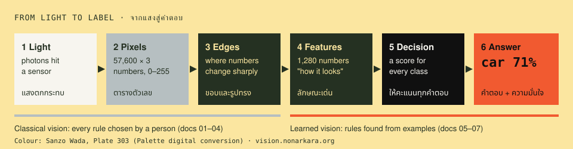

# The Vision handbook · คู่มือ Vision

**How a computer sees — explained with the code that runs [vision.nonarkara.org](https://vision.nonarkara.org).**
คอมพิวเตอร์มองเห็นอย่างไร อธิบายด้วยโค้ดจริงที่ทำงานอยู่บนเว็บไซต์



This handbook is for three kinds of reader:

| If you are… | Start here | Then |
|---|---|---|
| **Curious** — no code, just want to understand | [01 Pictures are numbers](01-pictures-are-numbers.md) | read in order; skip the code blocks |
| **A student or developer** learning computer vision | [01](01-pictures-are-numbers.md) + [`examples/`](../examples/) | run each lesson's example beside its chapter |
| **Building something like this** (a city, an agency, a company) | [System architecture](system/architecture.md) | [relay](system/relay.md) → [runtime](system/browser-runtime.md) → [CV-as-a-service blueprint](system/cvaas-blueprint.md) |

Every number in these pages was produced by code in this repository. Every PNG figure was drawn by it too — run `node examples/build-figures.mjs` and they are rebuilt from scratch (the six `docs/img/*.svg` diagrams are hand-drawn). Nothing here is a screenshot of a real camera: the scenes are synthetic, so they have an answer key and contain no people.

## The course · บทเรียน

Each chapter matches a room on the site. Seven of the eight have a runnable example (chapter 05's lesson is /learn itself); each ends with a Thai summary and a few questions to check yourself.

| # | Chapter | What you will be able to explain | Site | Run |
|---|---|---|---|---|
| 01 | [Pictures are numbers](01-pictures-are-numbers.md) · ภาพคือตัวเลข | pixels, resolution, RGB, why a computer "sees" nothing at first | [/learn](https://vision.nonarkara.org/learn) ch. 1 | `node examples/01-pixels.mjs` |
| 02 | [Light, colour and thresholds](02-colour-and-thresholds.md) · สี ความสว่าง และเกณฑ์ | grayscale, histograms, Otsu's method, why grayscale can erase a red car | /learn ch. 2–3 | `node examples/02-threshold.mjs` |
| 03 | [Convolution and edges](03-convolution-and-edges.md) · หน้าต่างเลื่อนและขอบ | the 3×3 window that every neural network is built from; Sobel | /learn ch. 4–5 | `node examples/03-convolution.mjs` |
| 04 | [Motion](04-motion.md) · การเคลื่อนไหว | frame differencing, thresholds against noise, connected regions | /learn ch. 6 · [/story](https://vision.nonarkara.org/story) | `node examples/04-motion.mjs` |
| 05 | [Neural networks](05-neural-networks.md) · โครงข่ายประสาทเทียม | learned kernels, layers, MobileNetV2, what "1,280 numbers" means | /learn ch. 7 | — |
| 06 | [Object detection](06-object-detection.md) · การหาวัตถุ | SSD, class scores, IoU, non-maximum suppression, precision vs recall | /learn ch. 7–8 · [/games](https://vision.nonarkara.org/games) | `node examples/05-detection-nms.mjs` · `node examples/06-precision-recall.mjs` |
| 07 | [Teaching a machine](07-transfer-learning.md) · สอนเครื่องด้วยตัวเอง | transfer learning, k-NN, a trained layer, loss, PCA, shortcut learning | [/train](https://vision.nonarkara.org/train) | `node examples/07-transfer-learning.mjs` |
| 08 | [Limits and ethics](08-limits-and-ethics.md) · ข้อจำกัดและจริยธรรม | why "not detected" ≠ "not there", bias, privacy, Thai PDPA | /learn ch. 8 · [/legal](https://vision.nonarkara.org/legal) | `node examples/08-catalogue.mjs` |

## The system · ระบบ

| Page | For |
|---|---|
| [Architecture](system/architecture.md) | the whole design on one page: sources → catalogue (the list of cameras) → relay → browser; every decision and its reason |
| [The frame relay](system/relay.md) | the one server component that touches imagery: threat model, rules, the code that enforces them |
| [The browser runtime](system/browser-runtime.md) | TF.js, WebGL, CSP without `eval`, model hosting and caching, how frames reach a model |
| [Operations](system/operations.md) | launchd, the Cloudflare tunnel, deploy, health checks, a runbook for when things break |
| [CV as a service — blueprint](system/cvaas-blueprint.md) | **proposed, not built**: what a commercial version would need, and what it must never become |

## Reference · อ้างอิง

| Page | |
|---|---|
| [Models](reference/models.md) | model cards: what each network is, what it was trained on, what it gets wrong, licences |
| [API](reference/api.md) | every endpoint (one web address you may ask for data) with real requests and responses |
| [Glossary · อภิธานศัพท์](reference/glossary.md) | about 100 terms in Thai and English, with the chapter that explains each |
| [Reading list](reference/reading-list.md) | the papers behind each chapter, every link checked |

## How to use the examples

```bash
git clone https://github.com/Nonarkara/vision.git
cd vision
node examples/01-pixels.mjs          # Node 22+, no install, no packages
```

Each example prints its working in the terminal (as text art, tables and charts) and writes pictures to `examples/out/`. Six of the eight import the **same** functions the website runs — `public/js/cv/ops.js` and `public/js/ml/learner.js` — so what you learn here is what runs there; `05` and `06` simulate detection on synthetic scenes and `08` reads the live catalogue. See [`examples/README.md`](../examples/README.md).

---

<sub>Part of vision.nonarkara.org. Diagrams use Sanzo Wada's Plate 303 as converted in [Palette](https://colors.nonarkara.org). Corrections welcome as [issues](https://github.com/Nonarkara/vision/issues).</sub>
