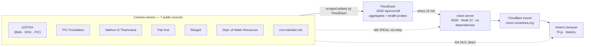
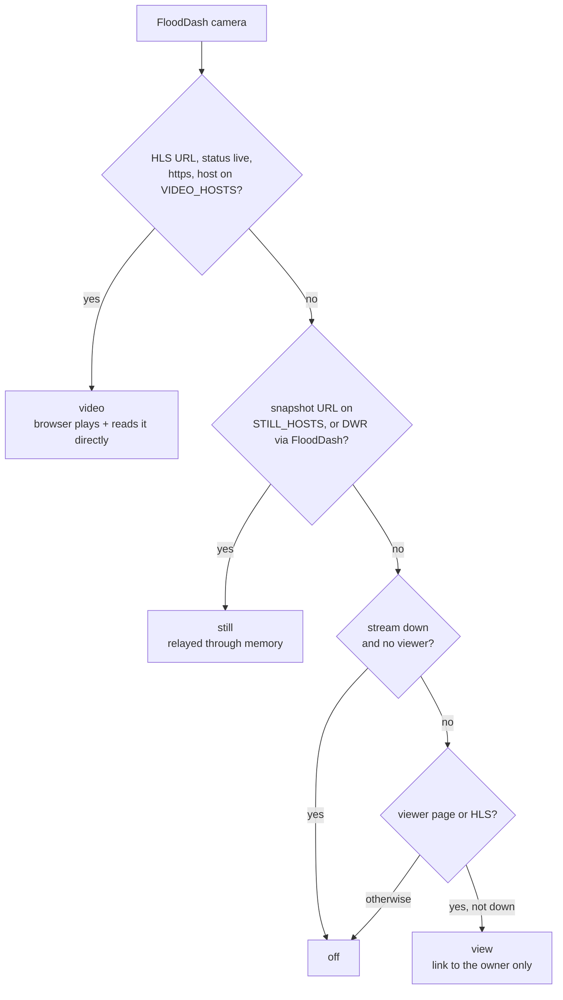

# System architecture · สถาปัตยกรรมระบบ

> **The design in one line:** the server never looks at a picture. It publishes a list of cameras, passes some still frames through memory, and serves a website — every model runs in the visitor's browser.

[← Handbook](../README.md) · Related: [relay](relay.md) · [browser runtime](browser-runtime.md) · [operations](operations.md) · [CVaaS blueprint](cvaas-blueprint.md)

---

## 1. Context



Four parts, one machine (a Mac running launchd), one tunnel:

| Part | Job | Lines of code |
|---|---|---|
| [`server/catalog.js`](../../server/catalog.js) | read FloodDash's camera list; classify every camera by what a browser can do with it; cache to disk | ~190 |
| [`server/relay.js`](../../server/relay.js) | fetch still frames from allow-listed hosts into memory, pass them same-origin | ~190 |
| [`server/http.js`](../../server/http.js) | static files, page assembly from partials, CSP and security headers, rate limits | ~220 |
| [`server/index.js`](../../server/index.js) | routes: `/api/cameras`, `/api/frame`, `/api/health`, pages | ~170 |
| [`public/js/`](../../public/js/) | everything that sees: sources, lenses, models, rooms | ~6,000 |

## 2. The decisions, and what we rejected

| Decision | Rejected alternative | Why |
|---|---|---|
| **Inference in the browser** (TF.js) | a GPU server analysing every camera | no server ever holds an analysed picture; cost scales with visitors' devices, not ours; a webcam frame never needs to leave the device; and it teaches — people watch the computation happen |
| **Read FloodDash's aggregate** | scrape the 7 sources ourselves | one aggregator, one set of politeness rules and one place to fix a broken source; FloodDash already health-probes streams |
| **Classify cameras by pixel access** (video/still/view/off) | show every camera the same way | a browser may only read pixels when the owner allows it (CORS); pretending otherwise produces broken instruments or silent failures |
| **Relay stills in memory only** | proxy and cache to disk / CDN | stills are useful for CV but most hosts lack CORS; memory with a 30 s life is the least we can hold to make them readable |
| **Live video direct from the owner** | proxy HLS through us | it already allows reading; proxying would put every video byte through our tunnel and our liability |
| **Zero dependencies, zero build** | a framework + bundler | the whole system can be read in an afternoon; nothing to `npm install`; nothing that rots |
| **Self-host models, fonts, libraries** | load from CDNs | no third-party request reveals a visitor's activity; CSP can be `'self'` only |
| **Strict CSP, no `eval`** | allow `'unsafe-eval'` for TF.js | a camera site is an attractive target; TF.js's one `eval` path is pre-empted instead (see [runtime](browser-runtime.md)) |
| **No accounts, cookies or analytics** | measure usage | nothing to leak, nothing to consent to; the PDPA surface stays minimal |
| **One process on one Mac via a tunnel** | cloud hosting | no inbound ports; costs nothing to run; the same pattern as FloodDash; failover is a known limitation |

## 3. Classifying a camera

Every camera in FloodDash's list becomes one of four kinds. The logic is `classify()` in [`catalog.js`](../../server/catalog.js):



```js
export const VIDEO_HOSTS = [/^camerai?1\.iticfoundation\.org$/, /^[a-z0-9-]+\.ipcamlive\.com$/]
export const STILL_HOSTS = [/^cctv\.maholan\.net$/, /^www\.thaiclouderp\.com$/, /^[a-z0-9-]+\.ipcamlive\.com$/]
```

The host lists were **measured**, not assumed: on 4 October 2026 every candidate host was probed with an `Origin: https://vision.nonarkara.org` header and its `Access-Control-Allow-Origin` response recorded. Only the two iTIC hosts and ipcamlive answered `*` for video; the still hosts answered without CORS (so they need the relay); Pak Kret's host timed out from this machine (it stays listed, and the relay's circuit breaker protects it).

Counts on 5 October 2026: **53 video · 2,578 still · 825 view · 477 off · 3,933 total.** Run `node examples/08-catalogue.mjs` for today's.

### The catalogue record

Slim on purpose — a full list is ~3,900 rows and every page loads it:

```json
{
  "id": "gistda:ITICM_BMAMI0076",
  "src": "gistda",
  "th": "ถนนสาทรหน้าสถานเอกอัครราชทูตเยอรมนี",
  "en": "",
  "loc": "",
  "lat": 13.72539,
  "lng": 100.5426,
  "k": "video",
  "v": "https://camera1.iticfoundation.org/hls/10.8.0.15_8552.m3u8",
  "w": "https://floodcheck.gistda.or.th/"
}
```

The **still URL is never published**: the browser asks `/api/frame?id=…` and the server looks the URL up in its own map. A visitor cannot make the relay fetch a URL of their choosing. Full field list: [API reference](../reference/api.md).

## 4. What happens when a page opens

```mermaid
sequenceDiagram
  participant B as Browser
  participant V as vision :8430
  participant O as Camera owner
  B->>V: GET /learn
  V-->>B: learn.html + partials, version-stamped
  B->>V: GET /api/cameras
  V-->>B: catalogue JSON (gzip, cached 60 s)
  Note over B: pick a readable camera
  alt kind = video
    B->>O: GET playlist.m3u8 + .ts segments (hls.js)
    O-->>B: video (CORS *)
  else kind = still
    B->>V: GET /api/frame?id=maholan:123
    V->>O: fetch JPEG (allow-listed, no redirects, 9 s)
    O-->>V: image/jpeg
    V-->>B: same bytes, same-origin (memory ≤ 30 s)
  end
  Note over B: lenses paint at ≤ 15 fps while visible
  B->>V: GET /models/ssdlite_mobilenet_v2/* (only when a model is asked for)
  V-->>B: 18 MB, cached a year at the edge
  Note over B: detection runs on the GPU via WebGL; results stay here
```

## 5. How it degrades

| Failure | What the visitor sees | Why it is safe |
|---|---|---|
| FloodDash down or slow | the last good catalogue, from disk (`origin: "disk"` in `/api/health`) | a stale list of cameras is still a list of cameras. Observed 4–5 Oct 2026: FloodDash's aggregate hung for ~13 hours; vision served its disk copy throughout |
| A camera owner down | "the camera's owner did not answer" + the next camera is tried | the specimen bar tries up to six cameras before asking you to pick |
| A still host failing repeatedly | 503 "resting after repeated failures" for 3 minutes | per-host circuit breaker: 8 consecutive failures open it |
| Too many requests | 429 with a polite message and `Retry-After` | per-IP token buckets (frames 600/min, burst 200; API 300/min, burst 120) |
| WebGL unavailable | TF.js falls back to the CPU backend — slower, still correct | `getTf()` tries `webgl`, then `cpu` |
| Models fail to load | the instrument says so; classical lenses keep working | models load lazily, per instrument |
| The Mac or tunnel down | the site is down | single host: an accepted limitation for a free classroom (see [blueprint](cvaas-blueprint.md) for what a service would need) |

## 6. Numbers worth knowing

| | |
|---|---|
| Catalogue refresh | every 10 min; 60 s timeout; disk fallback |
| Catalogue response | ~3,900 rows, gzip; built once per minute |
| Relay frame life | 30 s in memory, max 240 frames, max 4 MB each |
| Relay politeness | ≤ 4 upstream fetches at once, ≤ 2 per host, 9 s timeout |
| Detector | 18 MB · input squashed to 300 × 300 · 1,917 anchors · 90 classes |
| Embedder | 14 MB · 224 × 224 input · 1,280-number fingerprint |
| Server memory at rest | ~21 MB RSS (from `/api/health`) |
| Version stamping | `package.json` version in every asset URL and ETag |

---

### สรุปภาษาไทย

หลักการออกแบบ: **เซิร์ฟเวอร์ไม่เคยดูภาพ** มันแค่เผยแพร่รายชื่อกล้อง ส่งต่อภาพนิ่งบางส่วนผ่านหน่วยความจำ และให้บริการหน้าเว็บ ส่วนโมเดลทุกตัวทำงานในเบราว์เซอร์ของผู้ชม

กล้องทุกตัวถูกจัดเป็นสี่ประเภทตามสิ่งที่เบราว์เซอร์ทำได้จริง: **video** (วิดีโอสดที่เจ้าของอนุญาตให้อ่านพิกเซล) **still** (ภาพนิ่งที่ต้องส่งต่อผ่านหน่วยความจำ) **view** (ดูได้ที่เว็บเจ้าของเท่านั้น) และ **off** (ออฟไลน์) รายชื่อโฮสต์มาจากการวัดจริง ไม่ใช่การเดา

ทุกการตัดสินใจมีเหตุผลและทางเลือกที่ถูกปฏิเสธ เช่น ไม่ใช้เซิร์ฟเวอร์ GPU วิเคราะห์ภาพ เพื่อไม่ให้มีภาพที่ถูกวิเคราะห์ค้างอยู่บนเซิร์ฟเวอร์ และไม่ใช้ไลบรารีภายนอก เพื่อให้ทั้งระบบอ่านจบได้ในบ่ายเดียว เมื่อ FloodDash ล่ม ระบบยังให้บริการรายชื่อล่าสุดจากดิสก์ได้ (เกิดขึ้นจริงวันที่ 4–5 ต.ค. 2569 นานราว 13 ชั่วโมง)
