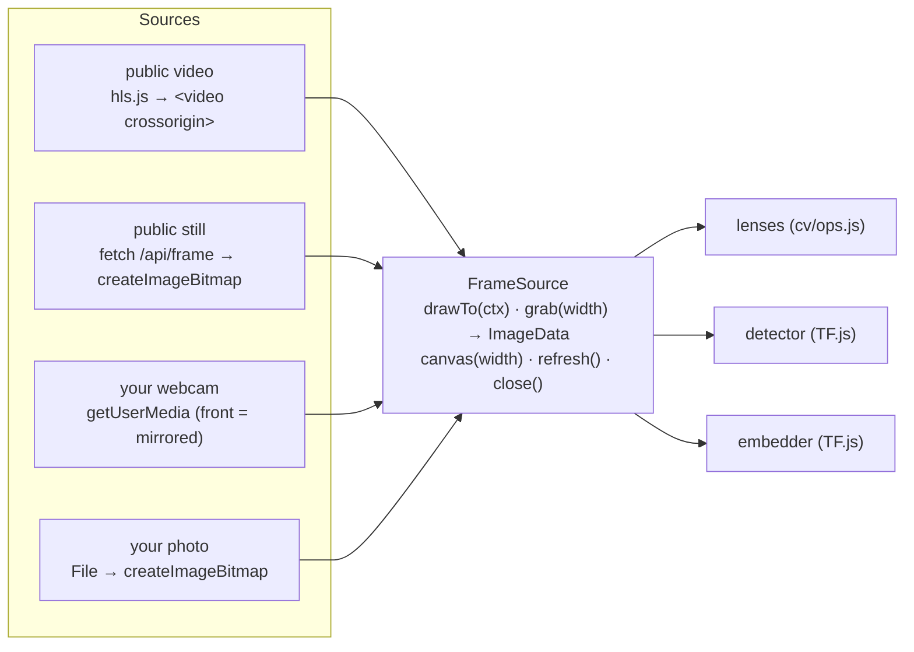

# The browser runtime · เครื่องยนต์ในเบราว์เซอร์

> How a frame from a road agency, your webcam or a photo ends up inside a neural network running on your graphics card — under a strict Content-Security-Policy, with nothing installed and nothing uploaded.

[← Architecture](architecture.md) · [Handbook](../README.md) · Code: [`public/js/core/`](../../public/js/core/) · [`public/js/ml/`](../../public/js/ml/)

---

## 1. Four sources, one interface

Every lens, model and game reads frames through one class, `FrameSource`, in [`core/source.js`](../../public/js/core/source.js). None of them care where a picture came from.



| Kind | How pixels arrive | Can a page read them? | Leaves the device? |
|---|---|---|---|
| `video` | hls.js loads playlist + segments into Media Source Extensions | yes: the owner sends CORS `*`, and the `<video>` is `crossOrigin = 'anonymous'` | — (arrives from the owner) |
| `still` | `fetch('/api/frame?id=…')` → `createImageBitmap(blob)` | yes: same origin | — |
| `webcam` | `getUserMedia({ video: { facingMode } })` | yes | **no** |
| `photo` | the chosen `File` → `createImageBitmap(file)` | yes | **no** |

### The "tainted canvas" rule, explained

If a page draws a picture from another site onto a `<canvas>` *without* that site's permission, the browser marks the canvas **tainted**, and `getImageData()` — the call that hands pixel numbers to JavaScript — throws a security error. This rule stops a malicious page from reading, say, your bank's logo-with-your-name. It is also why ~800 cameras on this site are *view only* and ~2,500 need the [relay](relay.md).

### Mirroring

A front camera is shown as a mirror, because that is what people expect. The mirroring happens **at the source** (`drawTo` flips the context), so every lens and model sees exactly what the person sees — "raise your left hand" works in the training room. Back cameras and laptops' unknown cameras are handled by reading the track's actual `facingMode`.

## 2. TF.js, loaded only when asked

[`ml/tf.js`](../../public/js/ml/tf.js) loads `/vendor/tf.min.js` (TensorFlow.js 4.22.0, 1.4 MB) **the first time a model is needed**, never on page load — 18 MB of weights is a real cost on a phone, and nobody should pay it for scrolling past.

```js
for (const backend of ['webgl', 'cpu']) {
  try { if (await tf.setBackend(backend)) break } catch { /* try the next one */ }
}
```

**WebGL** turns the network's arithmetic into graphics-card shader programs — usually many times faster than the CPU backend, which remains a correct (slower) fallback.

### Memory discipline

GPU memory is not garbage-collected like JavaScript objects. Every tensor is disposed explicitly or created inside `tf.tidy()`:

```js
const batched = tf.tidy(() => tf.expandDims(tf.browser.fromPixels(input)))   // freed by us below
const result = await model.executeAsync(batched)
batched.dispose()
// ... read result ...
tf.dispose(result)
```

A leak of one 640-wide frame per detection would fill a phone's GPU within minutes; the detector, embedder and every room are written to leave the tensor count flat.

### Non-maximum suppression stays on the GPU

The reference implementation (`@tensorflow-models/coco-ssd` 2.2.3) switches the whole TF.js backend to CPU to run NMS, then back. Our [`detector.js`](../../public/js/ml/detector.js) uses `tf.image.nonMaxSuppressionAsync` on the WebGL backend instead, so detection never changes global state that other instruments on the page depend on.

## 3. A strict CSP — and the one `eval` in TF.js

The site's policy (from [`server/http.js`](../../server/http.js)):

```
default-src 'self'; script-src 'self' https://static.cloudflareinsights.com; style-src 'self'; img-src 'self' data: blob:;
media-src 'self' blob: https://camerai1.iticfoundation.org https://camera1.iticfoundation.org https://*.ipcamlive.com;
connect-src 'self' https://cloudflareinsights.com <same three video hosts>; worker-src 'self' blob:; font-src 'self';
frame-src 'none'; object-src 'none'; base-uri 'none'; form-action 'self'; frame-ancestors 'none'
```

No inline scripts, no inline `style=""` attributes (instruments set sizes through the CSSOM instead). The only script allowed off this origin is Cloudflare’s cookieless analytics beacon (`static.cloudflareinsights.com`, reporting to `cloudflareinsights.com`). Other third-party traffic is the video hosts.

**The catch:** `tf.min.js` bundles `regenerator-runtime`, which assigns a bare global and, when strict mode refuses, falls back to `Function("r", "regeneratorRuntime = r")` — an `eval`, which this CSP blocks. Rather than weaken the policy with `'unsafe-eval'`, `getTf()` declares the global first:

```js
if (!('regeneratorRuntime' in window)) window.regeneratorRuntime = undefined
```

so the plain assignment succeeds and the `eval` path is never reached. One line, a whole class of injection attacks kept closed.

`worker-src blob:` is needed because hls.js parses video in a Web Worker built from a blob URL.

## 4. Models: hosting and caching

| Model | Folder | Size | Pieces |
|---|---|---|---|
| SSDLite MobileNetV2 (COCO) | `/models/ssdlite_mobilenet_v2/` | 18 MB | 5 × ~4 MB `.bin` |
| MobileNetV2 1.0 / 224 (ImageNet) | `/models/mobilenet_v2_1.0_224/` | 14 MB | 4 × ~4 MB `.bin` |

Both came from the TensorFlow.js model zoo (`storage.googleapis.com/tfjs-models/savedmodel/…`, Apache-2.0) and are **self-hosted**, so loading a model reveals nothing to a third party. A large model file is split into pieces, each called a **shard**, so several download at once. Those shard files were renamed to end in **`.bin`** and the manifests updated, because Cloudflare's edge caches by file extension and does not cache extension-less files — without the rename, every visitor would pull 32 MB through the tunnel from one Mac.

Caching policy (`cacheControl()` in `http.js`):

| Path | `Cache-Control` | Why |
|---|---|---|
| `/models/`, `/fonts/`, `/vendor/` | `public, max-age=31536000, immutable` | never change under the same path; a new model gets a new folder |
| `/img/`, `/data/` | `public, max-age=3600` | rarely change |
| pages, `/js/`, `/css/` | `no-cache` + ETag | ES-module imports cannot carry a `?v=` query; revalidating every load (a cheap 304) means a deploy is never half-visible |

## 5. Performance rules every instrument follows

- **Paint only what is seen.** `runLens()` and `runBench()` pause when the canvas scrolls off screen (`IntersectionObserver`) or the tab is hidden.
- **Cap the rate.** Lenses paint at ≤ 12–15 fps; the detector re-reads a moving picture every ~0.7 s; a still is re-analysed only when a new frame arrives.
- **Analyse small.** Motion at 192 px wide, classical lenses at 360, the detector at 640 (squashed to 300 inside), the embedder at 224.
- **One queue per model.** The training room sends every embedding — click, held record button, live preview, judge run — through one queue (`train/eye.js`), so they never fight over the GPU; repeat callers skip a beat instead of piling up.
- **Don't repaint the unchanged.** A still under unchanged settings is painted once; eight benches on /learn cost roughly what the visible one costs.

## 6. Try it in a console

On any page of the site, open the developer console:

```js
const { getTf, backend } = await import('/js/ml/tf.js')
const tf = await getTf()
backend()                                   // 'webgl' on most devices
const { detect } = await import('/js/ml/detector.js')
const img = document.querySelector('canvas')  // any instrument's canvas
const { detections, ms } = await detect(img, { minScore: 0.3 })
console.table(detections); ms              // boxes in 0–1 coordinates, and milliseconds
tf.memory().numTensors                      // should stay flat if you repeat the call
```

---

### สรุปภาษาไทย

ทุกเครื่องมืออ่านภาพผ่านคลาสเดียวคือ `FrameSource` ไม่ว่าภาพจะมาจากวิดีโอสด ภาพนิ่ง กล้องของคุณ หรือรูปของคุณ ภาพจากกล้องและรูปของคุณ **ไม่ออกจากเครื่องเลย**

เบราว์เซอร์มีกฎ "แคนวาสปนเปื้อน" (tainted canvas): ถ้าวาดภาพจากเว็บอื่นที่ไม่อนุญาต หน้าเว็บจะอ่านตัวเลขพิกเซลไม่ได้ นี่คือเหตุผลที่กล้องบางตัวดูได้อย่างเดียว และบางตัวต้องใช้ตัวส่งต่อ

TF.js โหลดเฉพาะเมื่อจำเป็น ใช้ WebGL ให้การ์ดจอคำนวณ (เร็วกว่าซีพียูมาก) ทุกเทนเซอร์ถูกคืนหน่วยความจำอย่างชัดเจน และนโยบายความปลอดภัย (CSP) เข้มงวดถึงขั้นห้าม `eval` โดยแก้ปัญหาในไลบรารีด้วยการประกาศตัวแปรล่วงหน้าเพียงบรรทัดเดียว แทนที่จะลดระดับความปลอดภัย

ไฟล์โมเดลถูกเก็บไว้บนเซิร์ฟเวอร์ของเราเอง เปลี่ยนนามสกุลเป็น `.bin` เพื่อให้ Cloudflare แคชไว้ได้ ผู้ชมจึงไม่ต้องดึงไฟล์ 32 MB จาก Mac เครื่องเดียวทุกครั้ง
