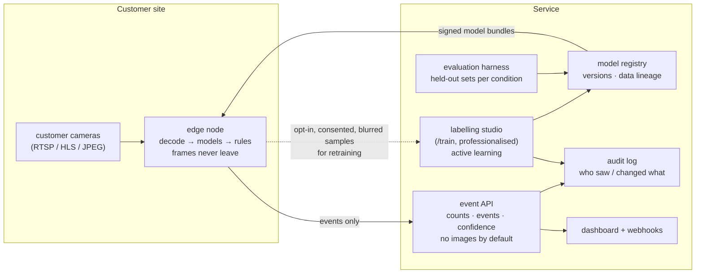

# Computer vision as a service — a blueprint · พิมพ์เขียวบริการ CV

> **Status: PROPOSED · NOT BUILT.** This page describes what a commercial version of this classroom would need. Nothing here is offered today, and nothing here is legal advice. It exists so that if the classroom becomes a product, it starts from the right shape — and with its red lines already drawn.

[← Architecture](architecture.md) · [Handbook](../README.md)

---

## 1. What the classroom already proves

| Capability a service needs | Proven here | Where |
|---|---|---|
| Ingest many heterogeneous public camera sources | 7 sources, ~3,900 cameras, classified by access | [`server/catalog.js`](../../server/catalog.js) |
| Read frames politely and safely | memory-only relay, allow-lists, breaker, limits | [`server/relay.js`](../../server/relay.js) · [relay.md](relay.md) |
| Run detection without a GPU server | SSDLite on WebGL in any browser | [`public/js/ml/detector.js`](../../public/js/ml/detector.js) |
| Custom models from a few examples, in seconds | MobileNetV2 embeddings + k-NN / softmax layer | [/train](https://vision.nonarkara.org/train) · [07](../07-transfer-learning.md) |
| Apply a model across many cameras | "judge the country" (24 cameras, polite) | [`public/js/train/judge.js`](../../public/js/train/judge.js) |
| Export / import a trained model | `vision.nonarkara.org/train-layer` JSON | [`public/js/train/layer.js`](../../public/js/train/layer.js) |
| Honest reporting | scores everywhere; "not detected ≠ not there" | every room |
| Privacy by architecture | no storage, no upload path, no identity models | [08](../08-limits-and-ethics.md) |

## 2. What a customer would actually buy

Not "AI cameras". **Answers to specific, aggregate questions, with measured error bars:**

| Customer | Question | Output |
|---|---|---|
| Flood / disaster agency | *Is there standing water on this road, and is it rising?* | per-camera water-presence events, human-confirmed |
| City traffic office | *How many vehicles by type passed, per 15 min?* | aggregate counts with confidence intervals |
| Municipality | *Is this underpass / canal / market crowded?* | density levels (low / medium / high), never identities |
| Industrial estate, port | *Is a lane blocked, a gate open, a zone entered by a vehicle?* | rule-based events from detections |
| Agriculture | *Which plots show this crop disease?* | per-image classification from a custom-trained model |

Each starts with a **custom model trained from the customer's own examples** — the /train workflow, professionalised.

## 3. Proposed architecture



### Design principles carried over from the classroom

1. **Edge first; events, not video.** Inference happens where the camera is (an on-site box, or a browser on the operator's machine — as here). The service receives numbers, not pictures. This is cheaper (no video egress), faster, and the strongest privacy guarantee: footage never leaves the customer.
2. **Answers carry their uncertainty.** Every event has a confidence and a model version; every dashboard number has an error bar from the evaluation harness.
3. **Silence is not safety.** No product feature may turn "nothing detected" into "all clear". Alerts are positive findings; absence is shown as "no finding", with the camera's health beside it.
4. **Humans decide.** Events that lead to action against a person or a property require human confirmation, logged in the audit trail.
5. **Every model is traceable.** Which examples, which version, which evaluation — so a bad decision can be explained and corrected.

### An event, as it would be sent

```json
{
  "camera": "customer-17:canal-gate-north",
  "at": "2026-10-05T03:41:20Z",
  "model": { "id": "water-presence", "version": "2026.10.02-3", "eval": "eval-0412" },
  "finding": "standing-water",
  "confidence": 0.83,
  "region": { "x": 0.41, "y": 0.62, "w": 0.33, "h": 0.21 },
  "camera_health": { "frames_last_5min": 60, "blur_score": 0.12, "dark": false },
  "frame_retained": false
}
```

Note what is **absent**: no image, no face, no plate, no track id, no person attributes.

## 4. The licensing audit (to finish with counsel before any sale)

| Component | Licence / terms | Commercial-use note |
|---|---|---|
| Our code and writing | © Dr Non Arkaraprasertkul, all rights reserved (`UNLICENSED`) | owner's choice |
| TensorFlow.js, hls.js | Apache-2.0 | permitted with notice |
| Model weights (SSDLite MobileNetV2, MobileNetV2) | Apache-2.0 (TF model zoo) | permitted with notice |
| COCO (detector training data) | annotations CC BY 4.0; images under their Flickr owners' licences | weights are generally treated as usable; confirm with counsel |
| ImageNet (embedder training data) | images for **non-commercial research** under ImageNet's terms of access | **open question** whether models trained on it may be sold; many companies do, but it is unsettled — get advice, or retrain the backbone on licensed data |
| Fonts (IBM Plex, Archivo Narrow, JetBrains Mono) | SIL OFL 1.1 | permitted |
| Popular YOLO implementations (if ever adopted) | several are **AGPL-3.0** | would oblige releasing the service's source; avoid or buy a commercial licence |
| **Public camera feeds** | owned by each agency | **the classroom's terms forbid commercial use without the owner's permission.** A commercial service needs written agreements with each camera owner, or must run only on the customer's own cameras |
| Colour (Wada Plate 303 via Palette) | historical combination; Palette's digital conversion credited | attribution kept |

## 5. Compliance work a service would add

Under Thailand's PDPA (and the GDPR for any EU customer), a service processing camera imagery on behalf of customers would typically need, at minimum:

- a clear **controller / processor** split with each customer, and a **data processing agreement**;
- **records of processing** and a **privacy impact assessment** per deployment, especially for any public-space camera;
- **signage and notice** at camera sites operated by customers;
- **retention limits** enforced in code (the default here: frames not retained at all);
- an **explicit consent** path — or simply no capability — for anything biometric (PDPA s.26 treats biometric data as sensitive);
- security controls: signed model bundles, encrypted transport, access logging, incident response.

## 6. Red lines — what this must never become

These are product decisions, written down before there is a product, so that no future sales conversation can quietly erase them:

- **No face recognition, no person re-identification, no gait recognition.**
- **No licence-plate reading** as a general feature (a customer's own gate-access system, on its own premises, with signage, is a separate, narrow product question).
- **No emotion, intent, ethnicity, gender or age inference** from faces or bodies.
- **No "find this person" search** across cameras, at any price, for any customer.
- **No sale or sharing of footage**, and no training on customers' footage without their explicit, revocable agreement.
- **No negative claims as safety signals** ("area clear", "no one in water").

## 7. From here to a pilot (if pursued)

| Step | Work | Builds on |
|---|---|---|
| 1 | Pick one partner and one question (e.g. water on a road, on the partner's own cameras) | FloodDash relationships |
| 2 | Collect and label examples across conditions (day/night/rain, every camera) | /train, professionalised |
| 3 | Evaluate per condition; publish precision/recall | [06](../06-object-detection.md) metrics, `examples/06` |
| 4 | Ship an edge node that emits events only | browser runtime, or a small box running the same models |
| 5 | Human-in-the-loop alerting + audit log | FloodDash alerting experience |
| 6 | Review: accuracy over 3 months, drift, operator feedback, privacy audit | — |

---

### สรุปภาษาไทย

**สถานะ: ข้อเสนอ ยังไม่ได้สร้าง** หน้านี้อธิบายว่าถ้าห้องเรียนนี้กลายเป็นบริการเชิงพาณิชย์ ควรมีรูปแบบอย่างไร

สิ่งที่ลูกค้าซื้อไม่ใช่ "กล้อง AI" แต่คือ **คำตอบต่อคำถามเฉพาะเจาะจงในระดับภาพรวม พร้อมค่าความคลาดเคลื่อนที่วัดแล้ว** เช่น มีน้ำท่วมขังบนถนนนี้หรือไม่ รถผ่านกี่คันต่อ 15 นาที

หลักการ: ประมวลผลที่ปลายทาง (edge) ส่งแต่ "เหตุการณ์" ไม่ส่งภาพ · ทุกคำตอบมีค่าความมั่นใจ · ความเงียบไม่ใช่ความปลอดภัย · คนเป็นผู้ตัดสินใจ · ทุกโมเดลตรวจย้อนได้

ก่อนขายจริงต้องตรวจสิทธิ์ใช้งานกับนักกฎหมาย โดยเฉพาะ ImageNet (ข้อตกลงเพื่อการวิจัยที่ไม่ใช่เชิงพาณิชย์) และ **กล้องสาธารณะเป็นของหน่วยงานเจ้าของ ต้องได้รับอนุญาตเป็นลายลักษณ์อักษร** หรือใช้เฉพาะกล้องของลูกค้าเอง

**เส้นที่ห้ามข้าม:** ไม่จดจำใบหน้า ไม่ระบุตัวบุคคลข้ามกล้อง ไม่อ่านทะเบียนรถเป็นฟีเจอร์ทั่วไป ไม่อนุมานอารมณ์ เชื้อชาติ เพศ หรืออายุ ไม่มีฟังก์ชัน "ค้นหาคนนี้" ไม่ขายภาพ และไม่ใช้ "ไม่พบ" เป็นสัญญาณว่าปลอดภัย
