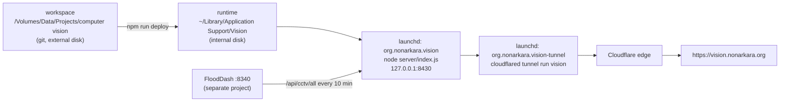

# Operations · การดูแลระบบ

> How vision.nonarkara.org runs, ships and gets fixed. One Mac, two launchd services, one Cloudflare tunnel, no cloud account beyond DNS.

[← Architecture](architecture.md) · [Handbook](../README.md) · Files: [`ops/`](../../ops/) · [`scripts/`](../../scripts/)

---

## 1. Topology



**Why a separate runtime folder?** The workspace lives on an external USB volume. launchd starts services at login, sometimes before that volume is mounted, and a service pointing at an absent path crash-loops. The runtime copy on the internal disk always exists; the deploy script refreshes it.

| Thing | Where |
|---|---|
| App service definition | `ops/org.nonarkara.vision.plist` → copied to `~/Library/LaunchAgents/` by deploy |
| Tunnel service definition | `ops/org.nonarkara.vision-tunnel.plist` |
| Tunnel routing | `ops/vision-tunnel.yml` (template) → `~/.cloudflared/vision.yml`: `vision.nonarkara.org → http://127.0.0.1:8430` |
| Tunnel credentials | `~/.cloudflared/<tunnel-id>.json` — **never in git** |
| Logs | `~/Library/Application Support/Vision/logs/org.nonarkara.vision.{out,err}.log` (JSON lines) |
| Catalogue cache | `~/Library/Application Support/Vision/data/cameras.json` (production keeps its own; deploy never overwrites a fresher one) |

The tunnel routes to `127.0.0.1`, **not** `localhost`: cloudflared may resolve `localhost` to IPv6 `[::1]` first while Node binds IPv4 only — a known source of intermittent 502s on this machine's other tunnels.

## 2. Develop

```bash
npm run dev            # http://localhost:8431, reads cameras from FloodDash on :8340
npm test               # unit tests: catalogue + store, relay, http, routes, CV ops,
                       #   learner, sources, demo scenes, layer races, handbook numbers
npm run check          # tests + scripts/check-site.mjs + scripts/check-docs.mjs
```

`check-docs.mjs` walks the handbook resolving every relative link and every GitHub-style heading anchor, and rejects `;` inside mermaid `sequenceDiagram` lines (GitHub cannot render those). `check-site.mjs` boots the real request handler on an ephemeral port (no FloodDash needed) and verifies: every page assembles; every local link and asset resolves; every module import points at a real file; every JS file parses; nothing the CSP would block (inline script, `style=""`) or a placeholder slipped into a page; every model shard listed in a manifest exists.

Webcam features need a secure context: `localhost` or https.

## 3. Ship

1. Bump `version` in `package.json` — it stamps asset URLs and ETags, and the health check proves which version is live.
2. `npm run deploy`, which ([`scripts/deploy-local.mjs`](../../scripts/deploy-local.mjs)):
   - runs `npm run check` and stops on any failure;
   - copies `server/` and `public/` to the runtime, **excluding** `public/CCTV photos/` (multi-megabyte originals; the site serves web copies from `public/img/ioc/`) and `.DS_Store`;
   - keeps production's catalogue if it has one;
   - installs the plist and `launchctl kickstart -k`s the service (or bootstraps it the first time);
   - polls `http://127.0.0.1:8430/api/health` for up to 60 s until it reports the new version and `ok: true`.
3. Verify from outside:

```bash
curl -sS https://vision.nonarkara.org/api/health | python3 -m json.tool
```

## 4. Health

`GET /api/health` — shape of the response; `version` and the counts change on every deploy and refresh:

```json
{
  "ok": true,
  "version": "1.2.0",
  "uptime_s": 14395,
  "catalogue": { "origin": "flooddash", "loadedAt": "2026-10-05T09:31:12.257Z",
                 "upstreamAt": "2026-10-05T09:29:02.059Z",
                 "video": 53, "still": 2675, "view": 857, "off": 477, "total": 4062 },
  "relay": { "cached_frames": 0, "inflight": 0, "waiting": 0, "checked_cameras": 0,
             "last_ok": 0, "last_failed": 0, "resting_hosts": [] },
  "memory_mb": 21
}
```

| Field | Healthy | Worry when |
|---|---|---|
| `catalogue.origin` | `flooddash` | `disk` for more than ~30 min → FloodDash's aggregate is failing |
| `catalogue.upstreamAt` | within the last ~10 min | hours old |
| `catalogue.video` | ~50 (50–60) | 0 → the iTIC hosts are down, or FloodDash's health probe marks everything down |
| `relay.resting_hosts` | `[]` | a host stays listed → that owner's server is failing; nothing to fix on our side |
| `relay.last_failed` vs `last_ok` | mostly ok | mostly failed → check one URL by hand (below) |
| `memory_mb` | 20–80 | climbing steadily → a leak; restart and report |

## 5. Runbook

### The site returns 502 / 530

```bash
launchctl list | grep vision                                   # both services present? PID column non-empty?
curl -sS -m 5 http://127.0.0.1:8430/api/health                 # app answering locally?
tail -20 ~/Library/Application\ Support/Vision/logs/org.nonarkara.vision.err.log
tail -20 ~/Library/Application\ Support/Vision/logs/org.nonarkara.vision-tunnel.err.log
cloudflared tunnel info vision                                 # connectors registered?
```

App down locally → `launchctl kickstart -k gui/$(id -u)/org.nonarkara.vision`. App fine locally but 530 outside → restart the tunnel service the same way (`org.nonarkara.vision-tunnel`).

### The catalogue is stale (`origin: "disk"`)

```bash
curl -sS -m 70 -o /dev/null -w '%{http_code} %{time_total}s\n' http://127.0.0.1:8340/api/cctv/all
grep 'catalogue refresh failed' ~/Library/Application\ Support/Vision/logs/org.nonarkara.vision.err.log | tail -3
```

**Worked incident, 4–5 October 2026.** The log showed `"catalogue refresh failed; keeping last good copy", "error": "The operation was aborted due to timeout"` every 10 minutes for ~13 hours. FloodDash's `/api/cctv` and `/api/health` answered in ~20 ms, but `/api/cctv/all` hung past 70 s — locally and on flood.nonarkara.org. Running the same aggregation in an isolated process finished in **2.7 s with 3,857 cameras**, so the sources were fine and the live process was wedged: its shared in-flight promise had never settled, and every request awaited it. FloodDash 4.150.1 added a hard deadline per source so a stuck source becomes `failed` instead of wedging everyone. Vision served its disk copy the whole time — the degradation worked as designed. *Lesson: cache a promise only together with a deadline.*

### A camera "never answers"

```bash
# what the relay would fetch is server-side; reproduce it by hand from the FloodDash record:
curl -sS -m 10 -o /dev/null -w '%{http_code} %{content_type} %{size_download}\n' "<snapshot_url>"
```

`502` from the owner, a timeout, or HTML instead of an image are the owner's problem; the breaker keeps us polite. A camera owner who wants it removed: see [/legal#takedown](https://vision.nonarkara.org/legal#takedown).

### A deploy is "not showing"

JS and CSS revalidate on every load (`no-cache` + ETag), so a normal reload shows the new version. Check what is being served:

```bash
curl -sS https://vision.nonarkara.org/ | grep -oE 'v=[0-9.]+' | sort -u
curl -sS https://vision.nonarkara.org/api/health | grep -o '"version":"[^"]*"'
```

Models, fonts and vendor files are cached for a year **by design** — ship a changed model under a new folder name, never over the old one.

### The external disk was unplugged

Production is unaffected (runtime is on the internal disk). Only `npm run deploy` and development need the workspace.

---

### สรุปภาษาไทย

ระบบทำงานบน Mac เครื่องเดียว มีบริการ launchd สองตัว: แอป (`org.nonarkara.vision` ที่พอร์ต 8430) และอุโมงค์ Cloudflare (`org.nonarkara.vision-tunnel`) โค้ดทำงานจากโฟลเดอร์ใน `~/Library/Application Support/Vision` บนดิสก์ภายใน เพราะดิสก์ภายนอกอาจยังไม่ถูกเมานต์ตอนเครื่องเปิด

ปล่อยเวอร์ชันใหม่: เพิ่มเลขเวอร์ชันใน `package.json` แล้วรัน `npm run deploy` สคริปต์จะตรวจทั้งเว็บ คัดลอกไฟล์ รีสตาร์ตเฉพาะแอป และรอจนเวอร์ชันใหม่รายงานว่าพร้อม จากนั้นตรวจ `/api/health` จากภายนอก

เหตุการณ์จริง 4–5 ต.ค. 2569: FloodDash ค้างนานราว 13 ชั่วโมง รายชื่อกล้องจึงไม่อัปเดต แต่เว็บไซต์ยังให้บริการด้วยรายชื่อล่าสุดจากดิสก์ได้ตามที่ออกแบบไว้ บทเรียน: การแคช promise ต้องมีกำหนดเวลาเสมอ
