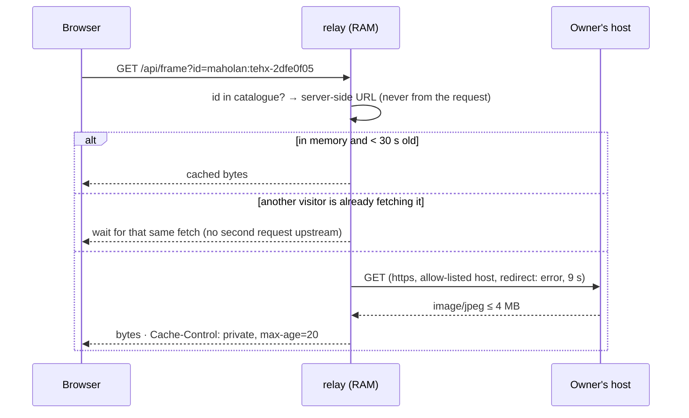

# The frame relay · ตัวส่งต่อภาพนิ่ง

> The one place this project touches camera imagery on a server — and therefore the place with the most rules. Code: [`server/relay.js`](../../server/relay.js) (187 lines) · tests: [`tests/relay.test.js`](../../tests/relay.test.js).

[← Architecture](architecture.md) · [Handbook](../README.md)

---

## 1. Why it exists

A web page may **display** a picture from any site, but it may only **read its pixels** — which computer vision needs — if that site sends `Access-Control-Allow-Origin` (CORS). Most Thai public cameras publish JPEG stills without that header. On 4 October 2026, of 40 sampled `cctv.maholan.net` stills, 22 returned a JPEG and **none** carried CORS.

Without a relay, ~2,500 cameras could be looked at but never analysed. The relay fetches a still into memory and hands the same bytes to the browser from our own origin, which the browser then allows a page to read.



## 2. Threat model

| Threat | What could go wrong | Mitigation in code |
|---|---|---|
| **Open proxy / SSRF** | someone makes our server fetch arbitrary URLs — internal services, attack targets | the request carries only a catalogue **id**; the URL comes from `catalog.relayMap`, built from FloodDash data filtered through `STILL_HOSTS` (https only) or a strict DWR pattern. `frame(id, resolve)` *"never builds a URL from request input"* |
| **Redirect escape** | an allowed host answers `302 → http://127.0.0.1/…` | `fetch(url, { redirect: 'error' })` — any redirect fails the request |
| **Local service exposure** | DWR stills come from FloodDash on `127.0.0.1:8340` | only the exact path `/api/cctv/dwr?id=<36-char UUID>` is ever built, by regex from FloodDash's own public URL |
| **Hammering camera owners** | 100 visitors on one camera = 100 requests to a city hall's server | 30 s memory cache; in-flight de-duplication; ≤ 4 upstream fetches at once, ≤ 2 per host |
| **Pounding a failing host** | a dead host gets retried by everyone, forever | per-host circuit breaker: 8 consecutive failures → host rests 3 minutes (503) |
| **Visitor scraping through us** | one client uses the relay as a free bulk downloader | per-IP token bucket: 600 frames/min, burst 200 → 429 + `Retry-After: 20`. Behind the tunnel the IP comes from `CF-Connecting-IP`, trusted **only** when the socket is loopback |
| **Content confusion** | upstream returns HTML or a script that we would serve same-origin | content-type must be `image/jpeg`, `image/png` or `image/webp`; served with that type and `X-Content-Type-Options: nosniff` |
| **Memory exhaustion** | a huge or endless response | `Content-Length` > 4 MB refused; the body is read in chunks and **cancelled the moment it passes 4 MB** (also catches chunked responses with no length); cache capped at 240 frames |
| **Not-a-picture** | an error page with an image type | bodies under 512 bytes are refused |
| **Retention creep** | frames quietly accumulate | no disk writes anywhere in the module; a sweeper empties expired frames every 15 s, so idle memory returns to zero |
| **Logging imagery or visitors** | logs become a surveillance archive | logs hold camera id, status and timing only; never bytes, never visitor IPs |

## 3. The rules, as constants

```js
export const FRAME_TTL_MS = 30_000          // a frame lives 30 s in memory
export const MAX_CACHE_ENTRIES = 240        // ...and at most 240 of them
export const MAX_FRAME_BYTES = 4 * 1024 * 1024
export const UPSTREAM_TIMEOUT_MS = 9_000
export const UPSTREAM_CONCURRENCY = 4       // fetches in flight, all hosts
export const PER_HOST_CONCURRENCY = 2       // fetches in flight, one host
export const BREAKER_FAILS = 8              // consecutive failures before a host rests
export const BREAKER_OPEN_MS = 3 * 60_000   // ...for three minutes
```

Change any of these and `tests/relay.test.js` tells you which promise you broke.

## 4. A worked example of politeness

Thirty visitors open /cameras and the census asks for 24 stills each, two at a time, with 700 ms pauses.

- Without the relay's cache, an owner's host might see 30 × 24 = 720 requests.
- With it, each camera is fetched **at most once per 30 seconds**, however many visitors ask: ≤ 24 requests per camera-batch, spread across hosts, never more than 2 in flight on any one host.
- If a host starts failing, after 8 failures it is left alone for 3 minutes, and visitors see "resting" instead of waiting 9 seconds each.

## 5. What the relay is not

- **Not an archive.** There is no way to ask for "the frame from 10 minutes ago".
- **Not an analyser.** It never decodes a JPEG; it cannot know what is in one.
- **Not for video.** Live HLS is played by the browser straight from the owner (it already allows reading).
- **Not a promise that a camera works.** `/api/cameras` marks a still `h: 1` or `h: 0` only after someone has looked, this session.

## 6. If you build one

Copy the shape, not just the code: **ids not URLs; allow-lists not block-lists; no redirects; size and type caps enforced while streaming; memory not disk; per-host politeness; a breaker; per-client limits; logs without content.** Then write the tests first — each row of the threat table above is a test case.

---

### สรุปภาษาไทย

กล้องสาธารณะส่วนใหญ่ของไทยเผยแพร่ภาพนิ่งโดยไม่มีส่วนหัว CORS ที่เบราว์เซอร์ต้องการก่อนจะยอมให้หน้าเว็บอ่านพิกเซล ตัวส่งต่อ (relay) จึงดึงภาพเข้าหน่วยความจำแล้วส่งให้เบราว์เซอร์จากโดเมนของเราเอง

กฎที่บังคับด้วยโค้ด: **เก็บในหน่วยความจำเท่านั้น ไม่เกิน 30 วินาที** ไม่เขียนลงดิสก์ · ผู้ขอส่งได้แค่ "รหัสกล้อง" ไม่ใช่ URL จึงสั่งให้เซิร์ฟเวอร์ไปดึงที่อื่นไม่ได้ · ไม่ตามการเปลี่ยนเส้นทาง (redirect) · ยอมรับเฉพาะไฟล์ภาพไม่เกิน 4 MB · ดึงพร้อมกันไม่เกิน 4 รายการ และไม่เกิน 2 ต่อโฮสต์ · โฮสต์ที่ล้มเหลวติดกัน 8 ครั้งจะถูกพัก 3 นาที · จำกัดอัตราต่อผู้ใช้ และบันทึกล็อกเฉพาะรหัสกล้อง สถานะ และเวลา ไม่บันทึกภาพหรือที่อยู่ของผู้ชม

ผลคือผู้ชมร้อยคนที่ดูกล้องตัวเดียวกัน ทำให้เจ้าของกล้องรับคำขอแค่ครั้งเดียวต่อ 30 วินาที
